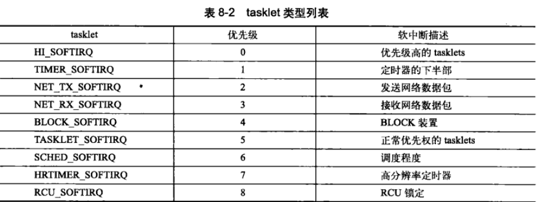

# 下半部和推后执行的工作

- 中断处理程序是异步执行，为了避免被打断的代码停止时间过长，中断处理程序应该执行得越快越好；
- 如果当前有一个中断处理程序正在执行，最好的情况下，IRQF_DISABLED没有被设置，与该中断同级的其他中断会被屏蔽。最坏情况下，IRQF_DISABLED被设置了，当前处理器上所有其他中断都会被屏蔽。禁止中断后硬件和操作系统无法通信。因此中断处理程序执行得越快越好；
- 中断处理程序不在进程上下文中运行，所以它们不能阻塞；

## 下半部

理想情况下，最好是中断处理程序将所有工作都交给下半部执行。中断处理程序注定要完成一部分工作。例如，中断处理程序几乎都需要通过操作硬件对中断的到达进行确认，有时还会从硬件拷贝数据。剩下的其他工作都是下半部执行的目标。例如上半部把数据从硬件拷贝到内存，那么应该在下半部处理它们。

对于上半部和下半部之间划分工作，尽管不存在某种严格的规则，但还是有一些提示可供借鉴：

- 如果一个任务对时间非常敏感，将放在中断处理程序中执行；
- 如果一个任务和硬件相关，将其放在中断处理程序中执行；
- 如果一个任务要保证不被其他中断打断，将其放在中断处理程序中执行；
- 其他所有任务，考虑放置在下半部执行；

### 为什么要用下半部

下半部并不需要指明一个确切的时间，只要把这些任务推迟一点，让它们在系统不太繁忙并且中断恢复后执行就可以了。通常下半部在中断处理程序一返回就会马上运行，下半部执行的关键在于**当它们运行时，允许响应所有中断**。

### 下半部的环境

和上半部只能通过中断处理程序实现不同，下半部可以通过多种机制实现。这些实现下半部的机制 分别由不同的接口和子系统组成。

#### 1. “下半部”的起源

最早Linux只提供“bottom half”机制实现下半部，称为“BH”。BH接口非常简单，提供了一个静态创建、由32个bottom halves组成的链表。上半部通过一个32位整数中的一位标识出哪个bottom half可以执行。每个BH都在全局范围内同步。即使分属不同的处理器，也不允许任何两个bottom half同时执行。

#### 2. 任务队列

内核开发者引入任务队列（task queue）机制来实现工作的推后执行，并且代替BH机制。内核为此定义了一组队列，其中每个队列都包含一个由等待调用的函数组成的链表。驱动程序会把它们自己的下半部注册到合适的队列上。这种机制不够灵活，对于一些性能要求较高的子系统，像网络部分，它也不能胜任。

#### 3. 软中断和tasklet

在2.3开发版本中，内核开发者引入了软中断（softirqs）和tasklet。如果无须考虑和过去开发的驱动兼容的话，软中断和tasklet可以完全代替BH接口。软中断是一组静态定义的下半部接口，有32个，可以在所有处理器上同时执行——即使两个类型相同也可以`(这里说的两个类型相同是指什么类型？？？)`。tasklet是一种基于软中断实现的灵活性强、动态创建的下半部实现机制。两个不同类型的tasklet可以在不同的处理器上同时执行，但类型相同的tasklet不能同时执行`(这和上面说的不就矛盾了吗？？？)`。对于大部分下半部处理来说，用tasklet就足够了，像网络这也对性能要求非常高的情况才需要使用软中断。使用软中断需要特别小心，因为两个相同的软中断有可能同时被执行。此外，软中断必须在编译期间就进行静态注册。与此相反，tasklet可以通过代码进行动态注册。

软中断和BH和tasklet是同一个层次上的概念。

2.5版本内核时，BH接口最终被弃置。2.6版本中，内核提供了三种不同形式的下半部实现机制：软中断、tasklet和工作队列。BH和任务队列接口已经被湮没在记忆中。

> 另外一个可以用于将工作推后执行的机制是内核定时器。内核定时器可以把操作推迟到某个确定的时间段之后执行。

## 软中断

软中断使用得比较少；tasklet 是下半部更常用的一种形式。但是，由于tasklet 是通过软中断实现的，软中断的代码位于 `kernel/softirq.c`中。

### 软中断的实现

软中断是在编译期间静态分配的。它不像tasklet那么能被动态注册或注销。软中断由 softirq_action 结构表示，定义在 `<linux/interrupt.h>`中

```c
struct softirq_action {
    void (*action)(struct softirq_action *);
};
```

`kernel/softirq.c`中定义了一个包含有32个该结构体的数组。

```c
static struct softirq_action softirq_vec[NR_SOFTIRQS];
```

每个被注册的软中断都占据该数组的一项，因此最多有32个软中断。这时一个定值——注册的软中断数目的最大值没法动态改变。当前内核（可能是2.6版本），这32个项中只用到9个。

#### 1. 软中断处理程序

软中断处理程序action的函数原型如下：

```c
void soft_handler(struct soft_action *);
```

其唯一的参数为指向相应 softirq_action 结构体的指针。例如，如果 my_softing 指向 softirq_vec 数组的某项，那么内核会用如下的方式调用软中断处理程序中的函数：

```c
my_softirq->action(my_softirq);
```

内核把整个结构体传递给软中断处理程序而不是数据值，可以保证将来在结构体总加入新的域时，无须对所有软中断处理程序都进行变动。

一个软中断不会抢占另外一个软中断，唯一可以抢占软中断的是中断处理程序。不够，其他软中断，甚至相同类型的软中断，可以在其他处理器上同时执行。

#### 2. 执行软中断

一个注册的软中断必须被标记后才会执行。这被称作触发软中断（raising the softirq）。通常，中断处理程序会在返回前标记它的软中断，使其在稍后被执行。于是，在合适的时刻，该软中断就会运行。在下列地方，待处理的软中断会被检查和执行。

- 从一个硬件中断代码返回时；
- 在ksoftirqd内核线程中；
- 在那些显示检查和执行待处理的软中断代码中，如网络子系统；

不管是用什么办法唤起，软中断都要在 do_softirq() 中执行。如果有待处理的软中断，do_softirq() 会遍历每一个，调用它们的处理程序，核心代码如下：

```c
u32 pending;

/* 保存待处理的位图 */
pending = local_softirq_pending;
if (pending) {
    struct softirq_action *h;
    
    /* 上面已经保存，所有这里可以重设待处理的位图 */
    set_softirq_pending(0);
    
    h = softirq_vec;
    do {
        if (pending & 1)
            h->action(h);
        h++;
        pending >>= 1;
    } while(pending);
}
```

以上是软中断处理的核心部分。

### 使用软中断

软中断保留给系统中对时间要求最严格以及最重要的下半部使用。目前（应该是2.6版本），只有两个子系统（网络和SCSI）直接使用软中断。此时，内核定时器和 tasklet 都是建立在软中断上的。如果想加入一个新的软中断，首先应该问问自己为什么用 tasklet 实现不了。tasklet 可以动态生成。对于时间要求严格并能自己高效地完成加锁工作的应用，软中断会是正确的选择。

#### 1. 分配索引

编译期间，通过在`<linux/interrupt.h>`中定义的一个**枚举类型**来静态地声明软中断。内核用这些从 0 开始的**索引来表示一种相对优先级**。**索引号小的优先级高**。

建立一个新的软中断必须在此枚举类型中加入新的项。而加入后，不能简单把新项加到列表的末尾。相反，你必须根据希望赋予它的优先级来决定加入的位置。习惯上，HI_SOFTIRQ 通常作为第一项，而 RCU_SOFTIRQ 作为最后 一项。新项可能插在 BLOCK_DOFTIRQ 和 TASKLET_SOFTIRQ 之间。



#### 2. 注册你的处理程序

接着，在运行时通过调用 open_softirq() 注册软中断处理程序，该函数有两个参数：软中断的索引号和处理函数。举个例子，网络子系统在 `net/coreldev.c` 通过以下方式注册自己的软中断：

```c
open_softirq(NET_TX_SOFTIRQ, net_tx_action);
open_softirq(NET_RX_SOFTIRQ, net_rx_action);
```

软中断处理程序执行的时候，允许响应中断，但它自己不能休眠。相同软中断可在不同处理器上触发，这意味着任何共享数据都需要严格的锁保护。它也是tasklet更受青睐的原因：**tasklet不能同时执行相同程序**。如果仅仅加锁防止并发，那么软中断就没有任何意义了。因此，大部分软中断处理程序，都通过采取单处理器数据或其他一些技巧来避免显示地加锁，从而提供更出色的性能。

引入软中断的主要原因是其可扩展性。如果不需要扩展到多个处理器，那么就使用 tasklet 吧。

> 此处的 “可扩展性” 指的是什么？？？

#### 3. 触发你的软中断

raise_softirq() 函数可以将一个软中断设置为挂起状态，让它在下次调用 do_softirq() 函数时投入使用。举个例子，网络子系统可能会调用：

```c
raise_softirq(NET_TX_SOFTIRQ);
```

这会触发 NET_TX_SOFTIRQ 软中断。该函数在触发一个软中断之前先要禁止中断，触发后再恢复原来的状态。如果中断本来就已经被禁止了，那么可以调用另一个函数 raise_softirq_irqoff()，这会带来一些优化效果。

**在中断处理程序中触发软中断**是最常见的形式。

## tasklet

tasklet和进程没有任何关系，和软中断在本质上很相似，行为表现也相似，但是，它的接口更简单，锁保护也要求较低。

选择软中断或tasklet其实很简单：通常你应该用tasklet。软中断的使用者屈指可数。它只在那些执行频率很高和连续性要求很高的情况下才需要使用。

### tasklet 的实现

tasklet 由两类软中断代表：HI_SOFTIRQ 和 TASKLET_SOFTIRQ。这两者的唯一区别在于， HI_SOFTIRQ 类型的软中断先于 TASKLET_SOFTIRQ 类型的软中断执行。

#### 1. tasklet 结构体

tasklet 由 tasklet 结构表示，每个结构体单独代表一个 tasklet，在`<linux/interrupt.h>`中定义。

- 结构体中的func成员是tasklet的处理程序（像软中断中的action一样），data是它唯一的参数；
- state 成员只能在0、TASKLET_STATE_SCHED 和 TASKLET_STATE_RUN 之间取值。
  - TASKLET_STATE_SCHED 表明 tasklet 已被调度，正准备投入运行；
  - TASKLET_STATE_RUN 表明该 tasklet 正在运行。只有在多处理器的系统上才会作为一种优化来使用，单处理器系统任何时候都清楚单个 tasklet 是不是正在运行。
- count 成员是tasklet的引用计数器。如果不为0，则tasklet 被禁止，不允许执行；只有当它为0时，tasklet才被激活，并且在被设置为挂起状态时，该tasklet 才能够执行。

#### 2. 调度 tasklet

已调度的 tasklet （等同于被触发的软中断）存放在两个单处理器数据结构：tasklet_vec（普通 tasklet）和 tasklet_hi_vec（高优先级的 tasklet）。这两个数据结构都是由tasklet_struct 结构体构成的链表。链表中的每个 tasklet结构体代表一个不同的 tasklet。

tasklet 由 tasklet_schedule() 和 tasklet_hi_schedule() 函数进行调度，区别在于一个使用 TASKLET_SOFYIRQ 而另一个使用 HI_SOFTIRQ。

tasklet_softirq() 的执行步骤：

1. 检查tasklet状态是否是 TASKLET_STATE_SCHED。如果是，说明已经被调度过了，函数立即返回；
2. 调用 _tasklet_schedule()；
3. 保存中断状态，禁止本地中断。在执行 tasklet 代码时，这么做能够保证当 tasklet_schedule() 处理这些 tasklet 时，处理器上的数据不会弄乱；
4. 把需要调度的 tasklet 加到每个处理器一个的 tasklet_vec 链表或 tasklet_hi_vec 链表的表头上去；
5. 唤起 TASKLET_SOFTIRQ 或 HI_SOFTIRQ 软中断；
6. 恢复中断到原状态并返回；

tasklet_action() 和 tasklet_hi_action() 是 tasklet 的处理核心，它们的操作如下：

1. 禁止中断，并未当前处理器检索 tasklet_vec 和 tasklet_hi_vec;
2. 将当前处理器上的该链表设置为NULL，达到清空的效果；
3. 允许响应中断；
4. 循环遍历获得链表上的每一个待处理的 tasklet；
5. 如果是多处理器系统，检查 TASKLET_STATE_RUN 判断是否正在其他处理器上运行，如果正在运行，现在就不要执行，跳到下一个待处理的 tasklet 去；
6. 如果当前 tasklet 没有执行，设置状态为 RUN，这也别的处理器就不会执行它了；
7. 检查 count 是否为0，确保 tasklet 没有被禁止。如果被禁止，则跳到下一个挂起的 tasklet 去；
8. 执行 tasklet 处理程序；
9. 运行完毕，清除 RUN 标志；
10. 重复执行下一个 tasklet，直到没有剩余的等待处理的 tasklet；

tasklet 的实现很简单，但非常巧妙。所有的 tasklet 都通过重复运用 HI_SOFTIRQ 和 TASKLET_SOFTIRQ 这两个软中断实现。当一个 tasklet 被调度时，内核就会唤起这两个软中断中的一个。随后，该软中断会被特定函数处理。执行所有已调度的 tasklet。这个函数保证同一时间只有一个给定的 tasklet 会被执行（但其他不同类型的 tasklet 可以同时执行）。

### 使用 tasklet

#### 1. 声明你的 tasklet

你既可以静态创建 tasklet，也可以动态地创建它。选择哪种方式取决于你到底是由一个对 tasklet 的直接引用还是间接引用。如果你准备静态创建一个 tasklet，使用下面 `<linux/interrupt.h>` 中定义的两个宏中的一个。

```c
DECLARE_TASKLET(name, func, data);
DECLARE_TASKLET_DISABLED(name, func, data);
```

当该 tasklet 被调度之后，给定的函数 func 会被执行，它的参数由data给出。这两个宏的区别在于计数器初始值不同。前面一个宏把创建的tasklet的计数器设置为0，该tasklet处于激活状态；另一个设置为1，处于禁止状态。

还可以通过将一个指针赋给一个动态创建的 tasklet_struct 结构的方式来初始化一个 tasklet_init()：

```c
tasklet_init(t, tasklet_handler, dev);
```

#### 2. 编写自己的tasklet处理程序

通过调用 tasklet_schedule() 函数并传递给它响应的 tasklet_struct 指针，该 tasklet 就会被调度以便执行：

```c
tasklet_schedule(&my_tasklet); /* 把 my_tasklet 标记为挂起 */
```

在没有得到运行机会之前，如果有一个相同的 tasklet 又被调度了，那么它仍然只运行一次，而如果这时已经开始运行了，比如说在另外一个处理器上，那么新的 tasklet 会被重新调度并再次运行。一个 tasklet 总在调度它的处理器上运行——希望能更好地利用处理器的高速缓存。

- 调用 tasklet_disable() 禁止某个tasklet，若 tasklet正在执行，会等执行完毕后返回；
- tasklet_diasble_nosync() 函数，无须等待。但往往不安全；

- 调用 tasklet_enable() 函数可以激活一个 tasklet，如果希望激活 DECLARE_TASKLET_DISABLE() 创建的 tasklet，也得调用这个函数。
- 调用 tasklet_kill() 从挂起队列中去掉一个 tasklet。会首先等待该 tasklet 执行完毕，然后再移去。由于该函数可能会引起休眠，所以禁止在中断上下文中使用它。

#### 4. ksoftirqd

每个处理器都有一组辅助处理软中断（和 tasklet）的内核线程。当内核出现大量软中断的时候，这些内核进程就会辅助处理他们。

对于软中断，内核会选择在几个特殊时机进行处理。软中断被触发的频率有时很高（像在及性能大流量的网络通信期间）。更不利的是，处理函数有时还会自行重复触发。也就是说，当一个软中断执行的时候，它可以重新触发自己以便再次执行（网路子系统就会这么做）。如果软中断频率较高，再加上它们又有将自己重新设置为可执行状态的能力，那么就会导致用户空间无法获得足够的处理器时间，因而处于饥饿状态。还不能单纯的对重复出发的软中断采取不立即处理的策略。让我们来看两种最容易想到的直观的方案：

1. 只要还有被触发并等待的软中断，本次执行就要负责处理，重新触发的软中断在本次执行返回前被处理。当负载很高的时候就会出问题。只有在系统低负载的情况下，这种方案才会有理想的运行效果；
2. 不处理重复触发的软中断。任何自行触发的软中断都不会马上处理，被放到下一个软中断执行时处理。而这个时机通常是下一次中断返回的时候。也就是得等一段时间，重新触发的软中断才能被执行。尽管它能保证用户空间不处于饥饿状态，但却让软中断忍受饥饿的痛苦，而且根本没有好好利用闲置的系统资源；

这种方是不会立即处理重新触发的软中断。而作为改良，当大量软中断出现的时候，内核会唤醒一组内核线程来处理这些负载，这些线程优先级最低，能避免和其他重要的任务抢夺资源，但最终它们会被执行。

每个处理器都有一个这样的线程。所有线程的名字都叫做 `ksoftirqd/n`，区别在于 n，它对应的是处理器的编号。在一个双 CPU 的机器上就有两个这样的线程，`ksoftirqd/0` 和 `ksoftirqd/1`。为了保证只要有空闲的处理器，它们就会处理软中断，所以给每个处理器都分配一个这样的线程。

```c
for (;;) {
    if (!softirq_pending(cpu))
        schedule();
    set_current_state(TASK_RUNNING);
    
    while (softirq_pending(cpu)) {
        do_softirq();
        if (need_resched())
            schedule();
    }
    
    set_current_state(TASK_INTERRUPTIBLE);
}
```

只要有待处理的软中断（由 softirq_pending() 函数负责发现），ksoftirq 就会调用 do_softirq() 去处理它们。只要 do_softirq() 函数发现已经执行过的内核线程重新触发它自己，软中断内核线程就会被唤醒。


