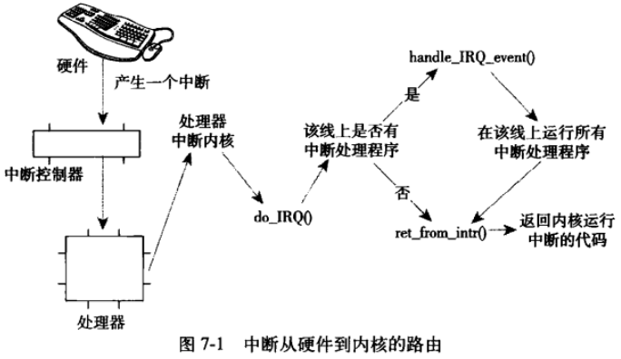
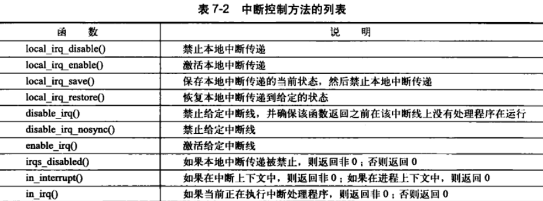

# 中断与中断处理

如何让处理器和这些外部设备能协同工作，且不会降低机器的整体性能呢？轮询（polling）可能会是一种解决方法。它可以让内核定期对设备的状态进行查询，并做出相应的处理。不过这种会让内核做不少无用功。更好的方法是提供一种机制，让硬件需要的时候再向内核发出信号。这就是中断机制。

## 中断

中断本身是一种特殊的电信号，由硬件设备发向处理器。硬件设备生成中断的时候并不考虑与处理器的时钟同步——换句话说就是中断随时产生，内核随时可能因为新到来的中断而被打断。

中断是一种电信号，由硬件设备生成，并直接送入中断控制器的输入引脚中——中断控制器是个简单的电子芯片，其作用是将多路中断管线，采用复用技术只通过一个与处理器相连接的管线与处理器通信。

不同设备对应的中断不同，而每个中断都有一个唯一的数字标志。这些中断值通常被称为中断请求（IRQ）线。每个IRQ线都会关联一个数值量。但并非所有的中断号都是这样严格定义的。例如，对于PCI总线上的设备而言，中断是动态分配的。重点在于特定的中断总是与特定的设备相关联，并且内核要知道这些信息。

> 异常
>
> 异常和中断不同，它在产生时必须考虑与处理器时钟同步。实际上，异常也常常称为同步中断。在处理器执行到由于编程失误而导致的错误指令（如被0除）的时候，必须靠内核来处理的时候，处理器就会产生一个异常。处理异常和处理中断的方式类似。

## 中断处理程序

在响应一个特定中断的时候，内核会执行一个函数，该函数叫做中断处理程序或中断服务例程。一个设备的中断处理程序是它设备驱动程序的一部分——设备驱动程序是用于对设备进行管理的内核代码。

在Linux中，中断处理程序就是普普通通的C函数，只不过这些函数必须按照特定的类型声明，以便内核能够以标准的方式传递处理程序的信息。中断处理程序运行在称为中断上下文的特殊上下文中，也被称作原子上下文，该上下文的执行代码不可阻塞。

中断随时发生，必须保证中断处理程序能快速执行，这样才能尽可能快地回复中断代码的执行。

## 上半部和下半部的对比

又想中断处理程序运行得快，又想中断处理程序完成的任务量多。鉴于两个目的之间存在此消彼长的矛盾关系，所以我们一般把中断处理切为两个部分。中断处理程序是上半部（top half）——接收到一个中断，它就会立即开始执行，但只做有严格时限的工作，例如对接受的中断进行应答或复位硬件，这些工作都是在所有中断被禁止的情况下完成的。能够被允许稍后完成的工作会推迟到下半部（bottom half）去。此后，在合适的时机，下半部会被开中断执行。

以网卡为例。当网卡收到内核的数据包时，需要立即通知内核数据包到了。内核通过执行网卡已注册的中断处理程序来做出应答。

中断开始执行，内核需要快速拷贝网络数据包到系统内存，因为网卡上接收网络数据包的缓存大小固定，而且相比系统内存要小得多，所以上述拷贝动作一旦被延迟，必然造成缓存溢出。当数据包被拷贝到系统内存后，中断的任务算是完成了，这时它会将控制权交还给系统被中断前运行的程序。处理和操作数据包的其他工作在随后的下半部中进行。

## 注册中断处理程序

驱动程序可以通过 request_trq() 函数注册一个中断处理程序，被声明在`<linux/interrupt.h>`，并且激活给定的中断线，以处理中断。

```c
// 成功返回0，失败返回非0.最常见的错误是 -EBUSY，表示给定的中断线已经在使用（或者没有指定IRQF_SHARED）
int request_irq(unsigned int irq,
               irq_handler_t handler,
               unsigned long flags,
               const char *name,
               void *dev);
```

- 第一个参数irq表示要分配的中断号，对某些设备来说，如键盘，这个值是预先确定的。但对大多数设备来说，这个值要么可以通过探测获取，要么可以通过编程动态确定。

- 第二个参数handler是一个指针，指向处理这个中断的实际中断处理程序。

  ```c
  typedef irqreturn_t (*irq_handler_t)(int, void *);
  ```

  ### 中断处理程序标志

  

- 第三个参数flags可以为0，也可能是下面一个或多个标志的位掩码。定于在文件 `<linux/interrupt.h>`

  - IRQF_DISABLED——该标志被设置后，意味着内核在处理中断处理程序本身期间，要禁止所有的其他中断。多数中断处理程序是不会去设置该位的，因为禁止所有中断是一种野蛮行为。

  - IRQF_SAMPLE_RANDOM——此标志表明这个设备产生的中断对内核熵池（entropy pool）有贡献。内核熵池负责提供从各种随机时间中导出的真正的随机数。如果设置该标志，那么来自设备的中断间隔时间就会作为熵填充到熵池。如果你的设备以预知的速率产生中断，就不要设置这个标志。很多硬件产生中断的速率是不可预知的，所以都能成为一种较好的熵源。

  - IRQF_TIMER——特别为系统定时器的中断处理准备的。

  - IRQF_SHARED——表明可以在多个中断处理程序之间共享中断线。在同一个给定线上注册的每个处理程序必须指定这个标志；否则每个线上只能由一个处理程序。

- 第四个参数name是与中断相关的设备的ASCII文本表示。例如键盘中断对应的这个值是 keyboard。这些名字会被 /proc/irq 和 /proc/interrupts 文件使用，以便于用户通信
- 第五个参数dev用于共享中断线。当一个中断处理程序需要释放时，dev将提供唯一的标志信息（cookie），以便从共享中断线的诸多中断处理程序中删除指定的那一个。如果无须共享中断线，那么该值为NULL。如果中断线是被共享的，那么就必须传递唯一的信息（除非设备又旧又破且位于ISA总线上，那么就必须支持共享中断）。内核每次调用中断处理程序时，都会把这个指针传递给它。实践中往往会通过它传递驱动程序的设备结构：这个指针是唯一的，而且有可能在中断处理程序内被用到。

注意，**request_irq() 函数可能会睡眠**，因此不能在中断上下文或者其他不允许阻塞的代码中调用该函数。在注册的过程中，内核需要在 /proc/irq 文件中创建一个于中断对应的项。函数 proc_mkdir() 就是用来创建这个新的 procfs 项的。proc_mkdir() 通过调用 proc_create() 对这个新的procfs项设置，而**proc_create() 会调用 kmalloc()**请求分配内存，该函数是可睡眠的。

### 释放中断处理程序

卸载驱动程序时，需要注销相应的中断处理程序，并释放中断线：

```c
void free_irq(unsigned int irq, void *dev);
```

如果指定的中断线（IRQ值）不是共享的，那么该函数删除处理程序的同时将禁用这条中断线。唯一的dev很重要，对于共享的中断线，需要一个唯一的信息区分其上面的多个处理程序，并让 free_irq() 仅删除指定的处理程序

## 编写中断处理程序

```c
static irqreturn_t intr_handler(int irq, void *dev);
```

中断处理程序的返回值是一个特殊类型：irqreturn_t。中断处理程序可能返回两个特殊的值：IRQ_NONE 和 IRQ_HANDLED。当中断处理程序检测到一个中断，但该中断对应的设备并不是在注册处理函数期间指定的产生源时，返回 IRQ_NONE。当中断处理程序被正确调用，且确实是它所对应的设备产生了中断时，返回IRQ_HANDLED。利用这些特殊值，内核可以直到设备发出的是否是一种虚假的中断。如果给定中断线上所有中断处理程序返回的都是IRQ_NONE，那么内核就可以检测到出了问题。irqreturn_t 实际上是一个 int 型。之所以使用这些特殊值是为了与早期的内核保持兼容。2.6之前的内核不支持这种类型，如果是2.4或更早的内核上使用这样的驱动程序，只需简单地将typedef irqreturn_t 改为void。中断处理程序通常标记为static，因为它从来不会被别的文件中的代码直接调用。

> 重入和中断处理程序
>
> Linux中断处理程序是无须重入的。当一个给定的中断处理程序正在执行时，相应的中断线在所有处理器上都会被屏蔽掉，以防同一个中断线接收另一个新的中断。同一个中断处理程序绝对不会被同时调用以处理嵌套的中断。

### 共享的中断处理程序

指定IRQF_SHARED标志以调用request_irq时，只有以下两种情况才可能成功：中断线当前未被注册，或者在该线上的所有已注册处理程序都制定了IRQF_SHARED。

内核接收到一个中断，将依次调用在该中断线上注册的每一个处理程序。因此，一个处理程序必须直到它是否该为这中断负责。如果与它相关的设备并没有产生中断，那么处理程序应该立即退出。这需要硬件设备提供状态寄存器，以便中断处理程序进行检查。

> 中断处理程序会先检查对应硬件设备的状态寄存器，是否是自己产生的中断，不是则退出。

## 中断上下文

进程上下文是一种内核所处的操作模式，此时内核代表进程执行——例如，执行系统调用或运行内核线程。在进程上下文中，可以通过current宏关联当前进程。因为进程是以进程上下文的形式连接到内核中的，因此进程上下文可以睡眠，也可以调用调度程序。

> “进程以进程上下文的形式连接到内核”是什么意思？？？我理解的进程上下文实际就是进程执行的代码位置，可能是指此时的内核可以看作是进程上下文的一部分；另一种理解是将 “进程上下文” 变为一个结构传入到内核中，”可以通过current宏关联“。无论哪一种，无论此时运行的代码是在进程代码中还是内核代码中，都是可以睡眠的。

中断上下文具有较为严格的时间限制，因为它打断了其他代码。正是因为这种异步执行的特性，所以所有的中断处理程序必须尽可能的迅速、简洁。

中断处理程序栈的设置是一个配置选项。曾经中断处理程序并不具有自己的栈。它们共享所中断进程的内核栈。内核栈的大小是两页，在32位体系结构上是8KB，在64位体系结构上是16KB。

在2.6版早期内核中，增加了一个选项，把栈的大小从两页减到一页，减轻了内存的压力。因为系统中每个进程原先都需要两页连续且不可换出的内核内存。为了应付栈大小的减少，中断处理程序拥有自己的栈，每个处理器一个，大小为一页。这个栈称为中断栈，尽管中断栈大小是原先共享栈的一般，但平均可用栈空间大得多，因为中断处理程序把这一整页占为己有。

## 中断处理机制的实现

中断处理系统的实现依赖于处理器、所使用的中断控制器的类型、体系结构的设计及机器本身。



在内核中，中断的旅程开始于预定义入口点。对每条中断线，处理器都会调到对应的唯一的位置。这样内核就可知道接收中断的IRQ号了。初始入口点只是在栈中保存这个号，并存放当前寄存器的值（这些值属于被中断的任务）；然后，内核调用函数do_IRQ()。声明如下：

```c
unsigned int do_IRQ(struct pt_regs regs);
```

因为C调用惯例是要把函数参数放在栈的顶部，因此pt_regs结构包含原始寄存器的值，这些值是以前在汇编入口例程中保存在栈中的`(这里是什么意思？？？)`。中断的值也会保存，所以，do_IRQ() 可以将它提取出来。

计算出中断号后，do_IRQ() 对所接收的中断进行应答，禁止这条线上的中断传递。在普通PC上，这些操作是由mask_and_ack_8259A() 来完成的。（8259A 为可编程中断控制器）。接下来，do_IRQ() 需要确保在这条中断线上有一个有效的处理程序，而且这个程序已经启动，但是当前没有执行，之后调用 handle_IRQ_event() 来运行为这条中断线安装的中断处理程序。handle_IRQ_event() 方法被定义在文件 kernel/irq/handler.c 中。

- 首先，因为处理器禁止中断，这里打开，必须在处理程序注册期间指定 IRQF_DISABLE 标志。
- 每个潜在的处理程序在循环中依次执行。若中断线非共享，第一次执行后就退出。
- 如果在注册期间制定 IRQF_SAMPLE_RANDOM 标志，则还要调用函数 add_interrupt_randomness()。
- 最后，再把中断禁止，函数返回到 do_IRQ()。
- do_IRQ() 做清理工作并返回到初始入口点，然后再从这个入口点跳到函数 ret_from_intr()。

ret_from_intr() 以汇编语言编写。检查重新调度是否正在挂起，如果挂起并且内核正在返回用户空间，那么 schedule() 将被调用。如果正在返回内核空间，只有 preempt_count 为0时，才能调用schedule()，否则内核抢占不安全。

在x86上，初始的汇编例程位于 arch/x86/kernel/entry_64.S，C 方法位于 arch/x86/kernel/irq.c。

## /proc/interrupts

procfs 是一个虚拟文件系统，它只存在于内核内存，一般安装于 /proc 目录。在 procfs 中读写文件都要调用内核函数，这些函数模拟从真实文件中读或写。interrupts 文件存放的是系统中于中断相关的统计信息。

```shell
(base) ubuntu@VM-24-2-ubuntu:~$ cat /proc/interrupts 
           CPU0       CPU1       
  0:         42          0   IO-APIC   2-edge      timer
  1:          9          0   IO-APIC   1-edge      i8042
  4:          0         27   IO-APIC   4-edge      ttyS0
  6:          3          0   IO-APIC   6-edge      floppy
  8:          0          0   IO-APIC   8-edge      rtc0
  9:          0          0   IO-APIC   9-fasteoi   acpi
 11:          0          0   IO-APIC  11-fasteoi   virtio2, uhci_hcd:usb1
 12:          0         15   IO-APIC  12-edge      i8042
 14:          0    9782890   IO-APIC  14-edge      ata_piix
 15:          0          0   IO-APIC  15-edge      ata_piix
 24:          0          0   PCI-MSI 98304-edge      virtio1-config
 25:          0   64845142   PCI-MSI 98305-edge      virtio1-req.0
 26:          0         30   PCI-MSI 81920-edge      virtio0-config
 27:   27219184          0   PCI-MSI 81921-edge      virtio0-input.0
 28:   28199271          1   PCI-MSI 81922-edge      virtio0-output.0
 29:          0   24482441   PCI-MSI 81923-edge      virtio0-input.1
 30:          1   27753263   PCI-MSI 81924-edge      virtio0-output.1
NMI:          0          0   Non-maskable interrupts
LOC: 3215572117 3255744839   Local timer interrupts
SPU:          0          0   Spurious interrupts
PMI:          0          0   Performance monitoring interrupts
IWI:       3245       3246   IRQ work interrupts
RTR:          0          0   APIC ICR read retries
RES:   36124694   36091364   Rescheduling interrupts
CAL: 1057100862  997486151   Function call interrupts
TLB:    9120266    9083120   TLB shootdowns
TRM:          0          0   Thermal event interrupts
THR:          0          0   Threshold APIC interrupts
DFR:          0          0   Deferred Error APIC interrupts
MCE:          0          0   Machine check exceptions
MCP:      31676      31676   Machine check polls
ERR:          0
MIS:          0
PIN:          0          0   Posted-interrupt notification event
NPI:          0          0   Nested posted-interrupt event
PIW:          0          0   Posted-interrupt wakeup event
```

- 第一列是中断线，没有显示没有安装处理程序的中断线；
- 第二列、第三列是接收中断条目的计数器，每个处理器都有一个；
- 第四列是处理这个中断的中断控制器。该示例说明具有I/O APIC的系统。
- 最后一列是与这个中断相关的设备名字。这个名字是通过参数 devname 提供给函数 request_irq() 的。如果中断是共享的，则这条中断线上的所有设备都会列出来；

## 中断控制

Linux内核提供了一组接口用于操作机器上的中断状态。这些接口为我们提供了能够禁止当前处理器的中断系统，或屏蔽整个机器的一条中断线的能力，可以在 `<asm/system.h>` 和 `<asm/irq.h>`中找到。

一般来说，控制中断系统的原因归根结底是需要提供同步。通过禁止中断，可以确保某个中断处理程序不会抢占当前代码。禁止中断还可以禁止内核抢占，但不能防止来自其他处理器的并发访问，因此内核代码一般都需要获取某种锁，防止来自其他处理器对共享数据的并发访问。

### 禁止和激活中断

用于禁止当前处理器（仅仅是当前处理器）上的本地中断，随后激活它们的语句是：

```c
local_irq_disable();
/* 禁止中断 */
local_irq_enable();
```

这两个函数通常以单个汇编指令实现，在x86中，禁中断仅仅是cli指令，激活中断只不过是sti指令。cli 和 sti 分别是对 clear 和 set 允许中断（allow interrupt）标志的汇编调用。

如果在调用disabe之前已经禁止了中断，那么该例程往往胡带来潜在的危险，同样相应的enable也存在风险。因为它无条件地激活中断。所有需要一种机制把中断恢复到以前的状态而不是简单地禁止或激活。内核中一个给定代码路径既可以在中断激活情况下达到，也可以在中断禁止情况下达到，因此，禁止中断之前保存中断系统的状态会更加安全一些。在准备激活中断时，只需把中断恢复到它们原来的状态。

```c
unsigned long flags;
local_irq_save(flags);
local_irq_restore(flags);
```

表面上flags是以值传递，实际参数包含具体体系结构的数据，也就是包含中断系统的状态，至少有一种体系结构把栈信息和值相结合（SPARC），因此flags不能传递给另一个函数（特别是它必须驻留在同一栈帧中）。

> 不再使用全局的 cli()
>
> 以前内核提供了一种“能够禁止系统中所有处理器上的中断”方法。如果另一个处理器调用这个方法，就不得不等待。这个函数就是 cli()，激活函数是 sti()。这些接口在2.5版本期间被取消。
>
> 取消全局cli()有不少有点
>
> - 首先，强制驱动程序编写者实现真正的加锁。要知道具有特定目的细粒度锁比全局锁要快许多，而且也完全温和 cli() 的使用初衷。
> - 其次，这也使得很多代码更具流线型，避免了代码的成簇布局。所以由此得到的中断系统更简单也易于理解。

### 禁止指定中断线

在某些情况下，只禁止整个系统中一条特定的中断线就够了。这就是所谓的屏蔽掉（masking out）一条中断线。作为例子，你可能对中断的状态操作之前禁止设备中断的传递，为此，Linux提供了四个接口。

```c
void disable_irq(unsigned int irq);
void disable_irq_nosync(unsigned int irq);
void enable_irq(unsigned int irq);
void synchronize_irq(unsigned int irq);
```

- 前两个函数禁止中断控制器上指定的中断线，即禁止给定中断向系统中所有处理器的传递。函数只有在当前正在执行的所有处理程序完成后，disable_irq() 才能返回。disable_irq_nosync() 不会等待当前中断处理程序执行完毕；

- synchronize_irq() 等待一个特定的中断处理程序的退出。如果该处理程序正在执行，那么该函数必须推出后才能返回；

  > 函数参数只有一个irq值，该中断线上会有很多处理程序，怎么指定特定的处理程序？？？

这些函数的调用可以嵌套，但要记住每次调用disable都要相应调用一次enable，只有对enable完成最后一次调用后，才真正重新激活中断线。所有这三个函数可以从中断或进程上下文中调用，而且不会睡眠。

禁止多个中断处理程序共享的中断线是不合适的。禁止中断线也就禁止了这条线上所有设备的终端传递。因此，用于新设备的驱动程序应该倾向于不适用这些接口。根据规范，PCI设备必须支持中断线共享，因此它们根本不应该使用这些接口。

### 中断系统的状态

通常有必要了解中断系统的状态（如中断是禁止的还是激活的），或者你当前是否正处于中断上下文的执行状态中。

宏 irqs_disable() 定义在 `<asm/system.h>`中。如果本地处理器上的中断系统被禁止，则它返回非0，否则返回-

在 `<linux/hardirq.h>` 中定义的两个宏提供一个用来检查内核的当前上下文的接口，它们是：

```c
in_interrupt();
in_irq();
```

- 第一个宏最有用：如果内核处于任何类型的中断处理中，它返回非0，说明内核正在执行中断处理程序或者正在执行下半部处理程序；

- 第二个宏只有在内核确实正在执行中断处理程序时才返回非0；

  > 什么区别？？？第一个宏的范围更大，包含了下半部处理程序？？



