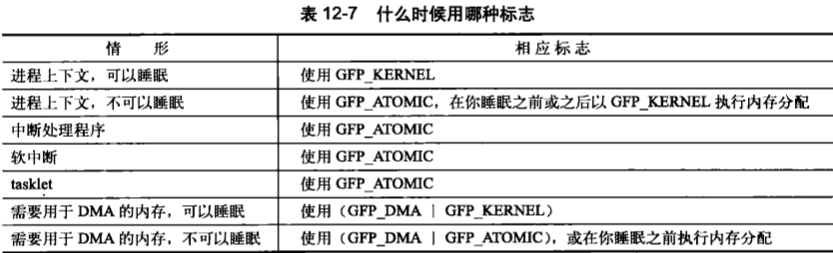

# 内存管理

内核之中获取内存的方法，与用户空间中的内存分配不太一样

## 页

内核把物理页作为内存管理的基本单位。内核管理单元（MMU，管理内存并把虚拟地址转换成物理地址的硬件）通常以页为单位处理，以页大小为单位管理系统中的页表。从虚拟内存的角度来看，页就是最小单位。

大多数32位体系结构支持4KB的页，64位一般会支持8KB的页。

内核用struct page结构表示系统中的每个物理页，位于`<linux/mm_type.h>`


1. flags：存放页的状态，包括页是不是脏的，是不是被锁定在内存中等，这些标志定义在`<linux/page-flags.h>`中
2. _count：存放页的引用计数，即这一页被引用了多少次，当计数值变为-1时，就说明当前内核并没有引用这一页。内核不直接检查该值，而是使用page_count()函数检查，函数唯一参数是page结构，虽然结构内部-1表示空闲，但是page_count()返回0表示空闲。一个页就可以由页缓存（mapping指向挂念的address_space对象）、或者作为私有数据（由private指向）、或者作为进程页表中的映射。
3. virtual：页的虚拟地址。通常情况下存放，但有些内存并不永久地映射到内核空间，这时该值为NULL，需要的时候动态映射。

**page结构与物理页相关，并非与虚拟页相关。**因此该结构对页的描述是短暂的，由于交换等原因，可能并不再和同一个page结构关联。内核仅用来描述当前时刻在相关物理页中存放的东西，目的在于描述物理内存本身，而不是描述其中的数据。

内核需要知道一个页是否空闲、若不空闲谁在使用。拥有者可能是用户空间进程、动态分配的内核数据、静态内核代码或页高速缓存等。

每个物理页都要分配结构体，会消耗多少内存。假设struct page占40字节内存，物理页8KB大小，由4GB内存，物理页就共有524288个，消耗内存不过20MB，代价不算高。

## 区

由于硬件的限制，内核并不能对所有页一视同仁。有些页在特定的物理地址上，因此不能用于执行一些特殊任务。内核把页划分为不同的区，使用区对具有相似特性的页进行分组。Linux必须处理如下两种由于硬件存在缺陷引起的内存寻址问题：

- 一些硬件只能用某些特定内存地址来执行DMA（比如x86的ISA设备只能访问物理内存的前16MB）
- 一些体系结构的内存的物理寻址范围比虚拟寻址范围大得多，这样就有一些内存不能永久地映射到内核空间。

因为存在这些制约，Linux主要使用了四种区：

- ZONE_DMA：这个区的页能用来执行DMA
- ZONE_DMA32：也是DMA，但是只能被32为设备访问
- ZONE_NORMAL：能正常映射的页
- ZONE_HIGHMEM：“高端内存”，其中的页不能永久映射到内核空间。

这些区在`<linux/memzone.h>`中定义。

区的实际使用和分布是与体系结构相关的。某些体系结构在内存的任何地址执行DMA都没问题，因此ZONE_DMA为空。ZONE_HIGHMEM的工作方式差不多，能否直接映射却决于体系结构。在32位x86上，它为高与896MB的物理内存。在其他体系结构上，内存都被直接映射，所以它为空。Linux高端内存和DOS的高端内存没有关系，DOS的是围绕DOS和x86的“实模式”的空间范围限制而言的。

Linux把系统页划分为区，形成不同的内存池。例如ZONE_DMA内存池让内核有能力为DMA分配需要的内存。。区的划分没有任何物理意义，只不过是内核为了管理页而采取的一种逻辑上的分组。

有一些分配可以从多个区中获取页。比如用于DMA的只能从ZONE_DMA中分配，但一般用途的既可以在ZONE_DMA中分配，又可以izZONE_NORMAL中分配，不过不可能同时从两个区分配，分配不能跨区界限的。

不是所有体系结构都定义了全部区，有些64位，如Intel的x86-64可以映射和处理64位内存空间，所以没有ZONR_HIGHMEM区，所有物理内存都处于ZONE_DMA和ZONE_NORMAL区。

每个区都用struct zone表示，在`<linux/memezone.h>`中定义，虽然这个结构体很大，但只有三个区需要表示。

1. 其中lock是自旋锁，防止并发访问。该锁只保护这个结构，并没有特定的锁保护单个页。
2. watermark 数组持有该区的最小值、最低和最高水位值，使用水位为每个内存区设置合适的内存消耗基准。该水位随空闲内存的多少而变化。
3. name是一个以NULL结束的字符串，表示这个区的名字。内核启动期间初始化这个值，代码位于`mm/page_alloc.c`中。

## 获得页

内核提供了一种请求内粗的底层机制，并提供了对它访问的几个接口，都以页为单位分配内存，定义在`<linux/gfp.h>`中。最核心的函数是：

```c
struct page *alloc_pages(gfp_t gfp_mask, unsigned int order)
```

该函数分配 2^order 个连续的内存页，并返回一个指针，指向第一个page结构体，出错则返回NULL。

```c
/* 把给定的页转换成逻辑地址 */
void *page_address(struct page *page)
```

```c
/* 与alloc_pages()作用一样，直接返回请求的第一个页的逻辑地址，其他页地址连续紧随其后 */
unsigned long __get_free_pages(gfp_t gfp_mask, unsigned int order)
```

如果只需一个页，可以使用

```c
struct page *alloc_page(gfp_t gfp_mask)
unsigned long __get_free_page(gfp_t gfp_mask)
```

### 获得填充为0的页

```c
/* 返回的页的内容全为0 */
unsigned long get_zeroed_page(unsigned int gfp_mask)
```

与_get_fre_pages()工作方式相同，只不过把分配好的页都填充为0，如果分配给用户空间，这个函数就非常有用，虽说分配好的页应该包含的随机产生的垃圾信息，可能“随机地”包含某些敏感信息。用户空间的页在返回之前，所有数据必须填充为0，或做其他清理工作。

### 释放页

可以用下面的函数释放

```c
void __free_pages(struct page *page, unsigned int order)
void free_pages(struct page *page, unsigned int order)
void free_page(unsigned long addr)
```

释放内存时要谨慎，传递错误的struct page或地址，用了错误的order值，都可能导致系统崩溃。

## Kmalloc()

该函数与用户空间的malloc()一族函数类似，不过多了一个flags参数。kmalloc()在`<linux/slab.h>`中声明。

该函数确保分配内存在**物理地址上是连续的，虚拟地址自然也是连续的**。

```c
/* 出错时返回NULL */
void *kmalloc(size_t size, gfp_t flags);

struct dog *p;
p = kmalloc(sizeof(struct dog), GFP_KERNEL);
if (!p)
{
    /* 处理错误 */
}
```

### gfp_mask标志

分配器标志可分为三类：

1. 行为修饰符：用何种方法分配内存。例如中断处理程序要求内核在分配内存的过程中不能睡眠。
2. 区修饰符：表示从哪个区分配内存
3. 类型：组合了行为修饰符和区修饰符，简化了修饰符的使用。

> 由于行为和区修饰符较多，这里暂不记录，只讨论类型标志


1. GFP_KERNEL：这种分配可能会引起睡眠，使用的是普通优先级，调用可能阻塞，因此只能在没有锁被持有的情况下使用。但由于没有约束，分配成功的可能性较高。
2. GFP_ATOMIC：表示不能睡眠的内存分配。GFP_KERNEL可以让调用者睡眠、交换、刷新一些页到硬盘等，空出足够的连续内存块，因此GFP_ATOMIC分配成功率小。即使如此，在当前代码（如中断处理程序、软中断和tasklet）不能睡眠时，页也只能选择GFP_ATOMIC。



### kfree()

声明于`<linux/slab.h>`中

```c
void kfree(const void *ptr)
```

分配和回收要注意配对使用，以避免内存泄漏和其他bug，调用kfree(NULL)是安全的。

## vmalloc()

**分配的虚拟地址连续，但物理地址无须连续**，类似于malloc()。

大多数情况下，只有硬件设备需要得到物理地址连续的内存。而仅供软件使用的内存就可以使用只有虚拟地址连续的内存块。

尽管某些情况下不需要物理连续的内存，但很多内核代码都用kmalloc()来获得内存，而不是vmalloc()，这主要出于性能的考虑。vmalloc()仅在不得已时才使用——典型的就是为了获得大块内存时，例如当模块被动态插入内核中时，就把模块装载到由vmalloc()分配的内存上。

vmalloc()声明在`<linux/vmalloc.h>`中，定义在`<mm/vmalloc.c>`中：

```c
void *vmalloc(unsigned long size)
```

函数可能睡眠，因此不能在中断上下文进行调用，也不能从其他不允许阻塞的情况下调用。

要释放vmalloc()获得的内存，使用：

```c
void vfree(const void *addr)
```

函数可能睡眠，因此不能在中断上下文进行调用.

## slab层

空闲链表相当于对象高速缓存——快速存储频繁使用的对象类型。空闲链表面临的主要问题之一是不能全局控制。当可用内存变得紧缺时，内核无法通知每个空闲链表，让其收缩缓存的大小以便释放出一些内存来。实际上内核根本不知道存在任何空闲链表。为弥补这一缺陷，Linux内核提供了slab层，也就是slab分配器。slab分配器扮演了通用数据结构缓存层的角色。

slab分配器试图在几个基本原则之间寻求一种平衡：

1. 频繁使用的数据结构应当缓存；
2. 频繁分配和回收会导致内存碎片，空闲链表的缓存应该连续地存放，因为已释放的数据结构又会放回空闲链表，因此不会导致碎片；
3. 回收的对象可用立即投入下一次分配；
4. 如果分配器知道对象大小、页大小和总的告诉缓存大小的概念，会做出更明智的决策
5. 如果部分缓存专属于单个处理器，分配和释放就可以在不加SMP（各个处理器之间共享总线，内存等等）锁的情况下进行；
6. 如果分配器是与[NUMA](https://zhuanlan.zhihu.com/p/67558970)相关的，就可以从相同的内存节点为请求者进行分配；
7. 对存放对象进行着色，已防止多个对象映射到相同的告诉缓存行

### slab层的设计

slab层把不同的对象划分为所谓高速缓存组，其中每个高速缓存组都存放不同类型的对象，每种对象类型对应一个高速缓存。kmalloc()接口建立在slab层上，使用一组通用高速缓存。高速缓存又被划分为slab。由一个或多个物理上连续的页组成。一般情况下slab仅仅由一页组成，每个高速缓存可以由多个slab组成。

每个slab都包含一些对象成员。当内核的某一部分需要一个新的对象时，先从部分满的slab中进行分配，如果没有部分满的就从空闲的分配，如果没有空的就要创建一个slab。这种策略能减少碎片。


每个高速缓存都使用kmeme_cache表示，这个结构包含三个链表：slabs_full、slabs_partial和slabs_empty，均存放在kmem_list3结构内，该结构在mem/slab.c中定义，这些链表包含高速缓存中的所有slab。

```c
struct slab {
    struct list_head 	list;		/* 满、部分满或空链表 */
    unsigned long		colouroff;	/* slab着色的偏移量 */
    void				*s_mem;		/* 在slab中的第一个对象 */
    unsigned int		inuse;		/* slab中已分配的对象数 */
    kmem_bufctl_t		free;		/* 第一个空闲对象（如果有的话） */
}
```

slab描述符要么在slab之外另行分配，要么放在slab自身开始的地方，如果slab很小或者内部有足够的空间容纳，就存放在slab里面。

slab分配器可以创建新的slab，通过__get_free_pages()低级内核页分配器实现的，忽略与NUMA相关代码：

```c
static inline void *kmem_getpages(struct kmem_cache *cachep, gfp_t flags)
{
    void *addr;
    
    flags |= cachep->gfpflags;
    addr = (void *)__get_free_pages(flags, cahep->gfporder);
    
    return addr;
}
```

接着调用kmem_freepages()释放内存，对特定的高速缓存页，kmem_freepages()最终调用的是free_pages()。slab只有在下列情况下才会调用释放函数：当可用内存变得紧缺时，系统试图释放出更多的内存以供使用；或者当高速缓存显示地被撤销时。

### slab分配器的接口

新的高速缓存通过以下函数创建

```c
struct kmem_cache *kmem_cache_create(const char *name,
                                    size_t size,
                                    size_t align,
                                    unsigned long flags,
                                    void (*ctor)(void *));
```

1. 第一个参数存放高速缓存的名字；
2. 第二个参数是高速缓存中每个元素的大小；
3. 第三个参数是slab内第一个对象的偏移，用来确保页内进行特定的对其。通常情况下，0就可以满足要求，也就是标准对其；
4. 第四个参数是可选设置项，用来控制高速缓存的行为，可以为0，表示没有特殊的行为；
5. 第五个参数ctor是高速缓存的构造函数。只有在新的页追加到高速缓存时，构造函数才被调用。实际上，Linux内核的高速缓存不使用构造函数，你可以将ctor赋值为NULL；

该函数不能在中断上下文中调用，因为它可能会睡眠。

要撤销一个高速缓存，则调用

```c
/* 成功返回0，否则返回非0值 */
int kmem_cache_destory(struct kmem_cache *cachep)
```

撤销函数也不能在中断上下文中调用，因为它也可能睡眠。调用该函数前必须确保存在以下两个条件：

1. 高速缓存中所有slab必须为空
2. 在调用撤销函数过程中不再访问这个高速缓存，调用者必须确保这种同步。

#### 1.从缓存中分配

创建高速缓存后，就可以通过下列函数获取对象：

```c
void *kmem_cache_alloc(struct kmem_cache *cachep, gfp_t flags)
```

从给定的高速缓存cachep中返回一个对象指针。如果该高缓中无空闲对象，那么slab层必须通过kmem_getpages()获取新的页，flags的值传递给__get_free_pages()。

释放一个对象，并把它返回给原先的slab，可以使用下面这个函数：

```c
void kmem_cache_free(struct kmem_cache *cachep, void *objp)
```

#### 2.slab分配器的使用实例

由于进程描述符是内核的核心组成部分，时刻都要用到，因此task_struct_cachep高速缓存绝不会被撤销掉。即使真能撤销，我们也要通过下列函数阻止：

```c
int err;

err = kmem_cache_destory(task_struct_cachep);
if (err)
    /* 出错，撤销高速缓存 */
```

slab层负责内存紧缺情况下所有底层的对齐、着色、分配、释放和回收。如果你要频繁创建很多相同类型的对象，那么，就应该考虑使用slab高速缓存。不要自己去实现空闲链表！

## 在栈上的静态分配

用户空间能够奢侈地负担起非常大的栈，而且栈空间还可以动态增长，相反，内核却不能这么奢侈——内核小而且固定。当给每个进程分配固定大小的小栈后，不但可以减少内存的消耗，而且内核也无须承担太重的栈管理任务。

进程的内核栈大小依赖体系结构，也与编译时的选项有关。历史上，每个进程都有两页的内核栈。

### 单页内核栈

在2.6系列内核早期，引入一个选项设置单页内核栈，当激活时，每个进程的内核栈只有一页那么大。这么做出于两个原因：

1. 可以让每个进程减少内存消耗；
2. 最重要的，随着机器运行时间的增加，寻找两个未分配的、连续的页变得越来越困难。

还有一个更复杂的原因。每个进程的调用链都放在自己的内核栈中，不过中断处理程序也曾使用它们所中断的进程的内核栈，这样，中断处理程序也要放在内核栈中，但是会把严格的约束条件加在可怜的内核栈上。当我们转而使用只有一个页面的内核栈时，中断处理程序就不放在栈中了。

为矫正这个问题**（什么问题？）**，内核开发者实现了一个新功能：中断栈。中断栈为每个进程提供了一个用于中断处理程序的栈。对每个进程来说仅仅耗费了一页。

### 在栈上光明正大地工作

在具体的函数中让所有局部变量所占空间之和不超过几百字节。在栈上进行大量的静态分配是很危险的。栈溢出时悄无声息，但势必会引发严重的问题。因为内核没有在管理内核栈上做足文章，多出的数据会直接溢出，覆盖掉紧邻栈末端的东西。首当其冲是thread_info结构。当栈溢出时，最好的情况是机器宕机，最坏的情况是悄无声息地破坏数据。因此动态分配是一种明智的选择。

## 高端内存的映射

高端内存中的页不能永久地映射到内核地址空间上，因此，通过alloc_pages()函数以__GFP_HIGHMEM标志获得的页不可能有逻辑地址。

在x86体系结构中，高于896MB的所有物理内存的范围大都是高端内存。一旦这些页被分配，就必须映射到内核的逻辑地址空间上**（为什么，前面不是说不可能有逻辑地址吗？）**，在x86上，高端内存中的页被映射到3GB~4GB。

逻辑地址与物理地址对应的关系为:

> 物理地址 = 逻辑地址 – 0xC0000000

内核逻辑地址空间访问为0xc0000000 ~ 0xffffffff，那么对应的物理内存范围就为0×0 ~ 0×40000000，即只能访问1G物理内存。因为内核 的地址空间已经全部映射到物理内存地址范围0×0 ~ 0×40000000。即使安装了8G物理内存，那么物理地址为0×40000001的内存


高端内存的最基本思想：借一段地址空间，建立临时地址映射，用完后释放，达到这段地址空间可以循环使用，访问所有物理内存。

### 永久映射

要映射一个给定的page结构到内核空间，可以使用定义在`<linux/highmem.h>`中的函数：

```c
void *kmap(struct page *page)
```

在高端或低端内存都能用。如果page结构对应低端内存中的一页，函数返回该页的虚拟地址。如果页位于高端内存，则会建立一个永久映射，再返回地址。这个函数可以睡眠，因此kmap只能用在进程上下文。

因为永久映射的数量优先，当不再需要高端内存时，应解除映射：

```c
void kunmap(struct page *page)
```

### 临时映射

当必须创建一个映射而当前的上下文又不能睡眠时，内核提供了临时映射（也就是原子映射）。有一组保留的映射，它们可以存放新创建的临时映射。内存可以原子地把高端内存中的一个页映射到某个保留的映射中。因此临时映射可以用在不能睡眠的地方，如中断处理程序，而且获取映射时绝不会阻塞。

```c
void *kmap_atomic(struct page *page, enum km_type type)
```

参数type描述了临时映射的目的，定义于`<asm/kmap_types.h>`

这个函数不会阻塞，可以用在中断上下文和其他不能重新调度的地方。它禁止内核抢占，这是有必要的，因为映射对每个处理器都是唯一的。通过下列函数取消映射：

```c
void kunmap_atomic(void *kvaddr, enum km_type type)
```

这个函数不会阻塞，除非激活内核抢占，否则该函数根本就无事可做，只有下一个临时映射到来前上一个临时映射才有效。因此，内核完全可以忘掉kmap_atomic()映射，kmap_atomic()也无须做什么实际的事情。下一个原子映射将自动覆盖前一个。

## 每个CPU的分配

支持SMP的现代操作系统使用每个CPU上的数据，对于给定的处理器其数据是唯一的。每个CPU的数据存放在一个数组上。2.6内核的很多代码依然用它，可以声明数据如下：

```c
unsigned long my_percpu[NR_CPUS];
```

按如下方式访问它

```c
int cpu;

cpu = get_cpu();	/* 获取当前处理器，并禁止内核抢占 */
my_percpu[cpu]++;
printk("my_percpu on cpu=%d is %lu\n", cpu, my_percpu[cpu]);
put_cpu();			/* 激活内核抢占 */
```

除当前处理器外，没有其他处理器接触到这个数，不存在并发访问问题，当前处理器可以在不用锁的情况下安全访问它。

现在内核抢占成了唯一的问题，内核抢占会引起下面的问题：

1. 代码被其他CPU抢占，此时CPU变量就会无效，因为它指向了错误的处理器。
2. 如果另一个任务抢占了你的代码，可能在同一个处理器上并发访问my_percpu的情况，

但是get_cpu()会禁止内核抢占。

## 新的每个CPU接口

2.6内核为方便创建和操作每个CPU数据，引进了新的操作接口，称作percpu，简化了创建和操作每个CPU的数据。头文件`<linux/percpu.h>`声明了所有的接口操作例程，你可以在文件`mm/slab.c`和`<asm/percpu.h>`中找到它们的定义。

### 编译时的每个CPU数据

```c
/* 为每一个CPU定义变量 */
DEFINE_PER_CPU(type, name);

/* 声明变量 */
DECLARE_PER_CPU(type, name);

/* 操作变量 */
get_cpu_var(name)++;	/* 增加该处理器上的name变量的值 */
put_cpu_var(name);		/* 完成；重新激活内核抢占 */

/* 获得其他cpu上的数据 */
per_cpu(name, cpu)++;
```

per_cpu()不会禁止内核抢占，也不提供任何形式的锁保护。

这些编译时每个CPU数据的例子并**不能在模块内使用**，因为连接程序实际上将它们创建在一个唯一的可执行段中（.data.percpu）。如果你需要**从模块中访问每个CPU数据**，或者如果你需要动态创建这些数据，那还是有希望的。

> 不矛盾吗？？？

### 运行时每个CPU数据

每个CPU数据的动态分配方，原型在文件`<linux/percpu.h>`中：

```c
/* 为每个处理器创建一个指定类型对象的实例 */
void *alloc_percpu(type);

/* 分配的字节数，分配时按多少字节对齐 */
void *__alloc_percpu(size_t size, size_t align);

/* 按照单字节对齐 */
void free_percpu(const void *);
```

```c
struct rabid_cheetah = alloc_percpu(struct rabid_cheetah);
/* 等价于， */
struct rabid_cheetah = __alloc_percpu(sizeof(struct rabid_cheetah), __aligof(struct rabid_cheetah));
```

__aligof()返回指定类型或lvalue所需的字节数

## 使用每个CPU数据的原因

好处

1. 减少数据锁定
2. 大大减少缓存失效。如果处理器操作某个数据，而该数据又存放在其他处理器缓存中，那么存放该数据的处理器必须清理或刷新自己的缓存，持续不断的缓存失效称为缓存抖动，对系统性能影响颇大。

唯一的安全要求是禁止内核抢占，但代价比上锁小得多，接口会自动帮你完成这个步骤。不能在访问每个CPU数据过程中睡眠，否则醒来可能已经到其他处理器上了。

如果决定在内核中使用每个CPU数据，考虑使用新接口，但新街口并不向后兼容之前的内核。

## 分配函数的选择

1. 如果需要连续的物理页，可以考虑kmalloc()；
2. 如果想从高端内存进行分配，使用alloc_pages()。访问它的唯一方式就是通过相应的struct page结构体。为了获得真正的指针，应该调用kmap()，把高端内存映射到内核的逻辑地址空间；
3. 如果仅仅需要虚拟地址上连续的页，使用vmalloc()；
4. 如果要创建和撤销很多大大数据结果，考虑简历slab高速缓存。

