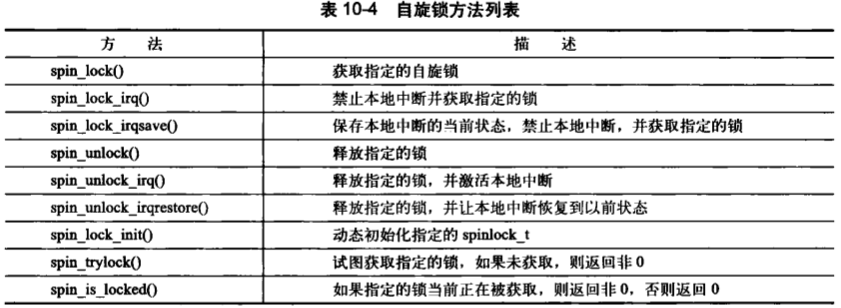
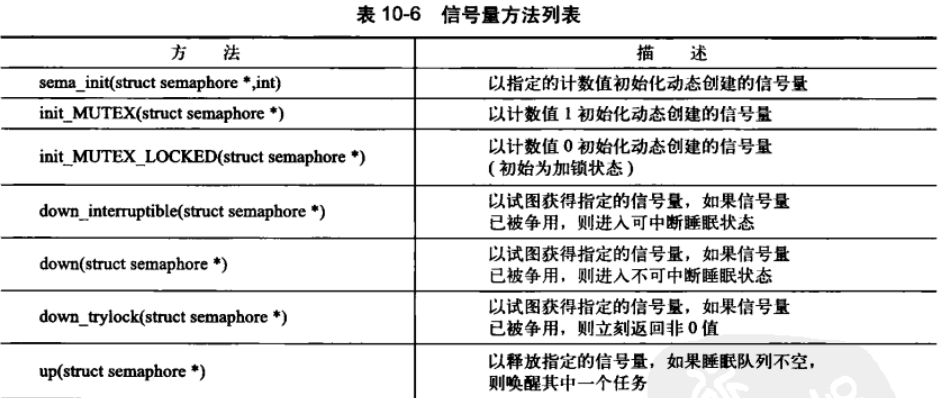
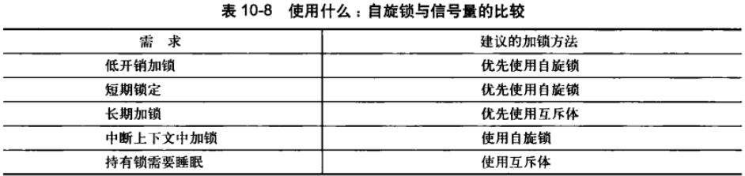
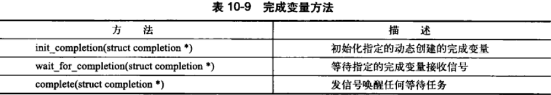
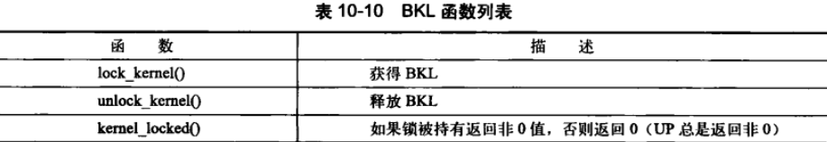
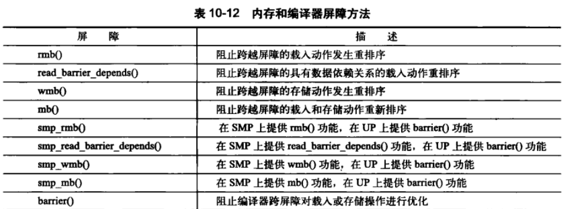

# 内核同步方法

## 原子操作

原子操作是指不能够被分割的指令。使用原子操作，读取和增加变量的竞争就不会发生。

内核提供了两组原子操作接口——一组针对整数进行操作，另一组针对单独的位进行操作。大多数体系结构会提供支持原子操作的简单算术指令。而有些体系结构确实缺少简单的原子操作指令，但为单步执行提供了锁内存总线的指令，这就确保其他改变内存的操作不能同时发生。

### 原子整数操作

针对整数的原子操作只能对atomic_t类型的数据进行处理。这里引入特殊数据类型而不是int的原因：

1. 让原子函数只接收atomic_t类型的操作数，可以确保原子操作只与这种特殊类型数据一起使用。保证该类型数据不会被传给任何非原子函数。
2. atomic_t类型确保编译器对相应的值进行访问优化——这使得原子操作最终接收到正确的内存地址，而不是一个别名
3. 在不同体系结构上实现原子操作的时候，使用atomic_t可以屏蔽其间的差异

定义在文件`<linux/types.h>`

```c
typedef struct {
    volatile int counter;
} atomic_t;
```

使用atomic_t的代码只能将该类型数据当作24位用。这个限制完全是因为SPARC体系结构上，原子操作不同于其他体系结构：32位int类型的低8位被嵌入了一个锁。因为SPARC体系结构对原子操作缺乏指令级的支持。

使用原子整型操作需要的声明都在`<asm/atomic.h>`中。所有体系结构都能保证内核使用到的所有操作的最小集、

```c
atomic_t v;						// 定义
atomic_t u = ATOMIC_INIT(0);	// 定义并初始化0

atomic_set(&v, 4);	// v = 4
atomic_add(2, &v);	// v = v + 2 = 6
atomic_inc(&v);		// v = v + 1 = 7
atomic_read(&v);	// 将atomic_t转为int

int atomic_dec_and_test(atomic_t *v);	// 原子变量减1，若为0返回真
```

原子操作通常是内联函数，往往是通过内嵌汇编指令来实现的。如果某个函数本来就是原子的，那它往往会被定义成一个宏。例如把atomic_read()定义成宏。

> 原子性和顺序性的比较
>
> 一个字长的读取总是原子地发生，绝不可能对同一个字交错地进行写。这就是所谓的原子性。
>
> 也许代码有比这更多的要求。或许要求读必须在特定的写之前发生——这种需求不属于原子性操作，而是顺序性操作。原子性确保指令执行期间不被打断，要么全部执行完，要么根本不执行。顺序性确保即使两条或多条指令出现在独立的执行线程中，甚至独立的处理器上，它们本该的执行顺序仍然要保持。

能使用原子操作，就尽量不要使用复杂的加锁机制。原子操作与更复杂的同步方法相比，给系统带来的开销小，对高速缓存行的影响也小。但是，对于有高性能要求的代码，对多种同步方法进行测试比较，不失为一种明智的做法。

### 64位原子操作

原子变量除32位的atomic_t类型外，也应引入64位的atomic64_t。使用方法与32位一样。atomic64_t类型其实是对长整型的一个简单封装类。

```c
typedef struct {
    volatile long counter;
} atomic_t;
```

### 原子位操作

定义在文件`<asm/bitops.h>`中。位操作是对普通的内存地址进行操作的。参数是一个指针和一个位号，第0位是给定地址的最低有效位。虽然使用原子位操作在多数情况下是对一个字长的内存进行访问，因而位号应该位于0~31，但是，对位号的范围并没有限制。

```c
unsigned long word = 0;

set_bit(0, &word);	// 第0位置1
set_bit(1, &word);	// 第1位置1
printk("%ul\n", word);	// 打印出3
clear_bit(1, &word);	// 清空第1位
change_bit(0, &word);	// 翻转第0位的值，这里它被清空

// 原子地将第0位置1并返回设置去的值
if (test_and_set_bit(0, &word)) {
    
}
```

内核还提供一组与上述操作对应的非原子位函数，操作相同但不保证原子性，且其前缀多两个下划线。例如test_bit()对应的非原子形式是 __test_bit()。如果不需要原子性操作，那么这些非原子的位函数相比原子的位函数可能会执行得更快些。

内核还提供了两个例程用来从指定的地址开始搜索第一个被设置（或未被设置）的位。

```c
int find_first_bit(unsigned long *addr, unsigned int size);
int find_first_zero_bit(unsigned long *addr, unsigned int size);
```

如果你要搜索的范围仅限一个字，使用 _ffs() 和 ffz() 这两个函数会更好，它们只需要给定一个要搜索的地址做参数。

## 自旋锁

Linux最常见的锁是自旋锁（spin lock）。自旋锁最多只能被一个可执行线程持有，如果一个执行线程试图获得一个被已经持有的自旋锁，那么该线程就会一直进行忙循环——旋转——等待锁可用（也就是自选，这是对于竞争者来说的）。同一个锁可以用在多个位置，例如，对于给定数据的所有访问都可以得到保护和同步。

线程自旋（特别浪费处理器时间），这种行为是自旋锁的要点，所以自旋锁不应该被长时间持有。这正是使用自旋锁的初衷：在短时间内进行轻量级的加锁。还可以采用另外的方法：让请求线程睡眠，直到锁重新可用时再唤醒它。这也会带来一定开销——这里有两次明显的上下文切换，与实现自旋锁的少数几行代码相比，上下文切换当然有较多的代码。最好让持有自旋锁的时间尽可能短。

### 自旋锁方法

自旋锁代码往往通过汇编实现。定义在文件`<asm/spinlock.h>`中。实际用到的接口定义在文件`<linux/spinlock.h>`中。自旋锁的基本使用形式如下：

```c
DEFINE_SPINLOCK(mr_lock);
spin_lock(mr_lock);
// 临界区
spin_unlock(mr_lock);
```

在单处理器上，编译的时候不会加入自旋锁。它仅仅被当作一个设置内核抢占机制是否被启用的开关。如果禁止内核抢占，编译时自旋锁会被完全剔出内核。

> 自旋锁是不可递归的！
>
> Linux实现的自旋锁是不可递归的，所以如果你试图得到一个你正持有的锁，你必须自旋，等待你自己释放这个锁。所以永远没有机会释放锁，于是你被自己锁死了。千万小心自旋锁！

自旋锁可以使用在中断处理程序中（此处不能使用信号量，因为它们会导致睡眠）。在中断处理程序中使用自旋锁时，一定要在获取锁之前，首先禁止本地中断，否则，中断处理程序会打断正持有锁的内核代码，有可能会尝试争用这个已经被持有的内旋锁，中断处理程序就会自旋，等待该锁重新可用，此时发生死锁。需要关闭的是当前处理器上的中断。

内核提供的禁止中断同时请求锁的接口如下：

```c
DEFINE_SPINLOCK(mr_lock);
unsigned long flags;

spin_lock_irqsave(&mr_lock, flags);
// 临界区
spin_unlock_irqsave(&mr_lock, flags);
```

spin_lock_irqsave()保存中断的当前状态，并禁止本地中断，然后再去获取指定的锁。unlock对指定的锁解锁，然后让中断恢复到加锁之前的状态。

> 调试自旋锁
>
> 配置选项CONFIG_DEBUG_SPINLOCK为使用自旋锁的代码加入了许多调试测试手段。例如，激活该选项，内核就会检查是否使用了未初始化的锁，是否在还没加锁的时候就要对锁执行开锁操作。

### 其他针对自旋锁的操作

spin_try_lock()试图获取某个特定的自旋锁，如果该锁已经被占用，那么该方法会立刻返回一个非0值，而不会自选等待锁被释放。



### 自旋锁和下半部

由于下半部可以抢占进程上下文的代码，所以当下半部和进程上下文共享数据时，必须对进程上下文中的共享数据进行保护，所以需要加锁的同时禁止下半部执行。

## 读-写自旋锁

当某个数据结构的操作可以被划分为读/写或者消费者/生产者两种类别时，类似读/写锁这样的机制就很有帮助了。Linux内核提供了专门的读-写自旋锁。这种自旋锁为读和写分别提供了不同的锁。一个或多个读任务可以并发地持有读者锁；想法，用于写的锁最多只能被一个写任务持有，而且此时不能有并发的读操作。有时把读/写锁叫做共享/排斥锁，或者并发/排斥锁，因为这种锁以共享（对读者而言）和排斥（对写者而言）的形式获得使用。

可以通过下面的方式初始化

```c
DEFINE_RWLOCK(mr_rwlock);
```

通常情况下，读锁和写锁会位于完全分割开的代码分支中，不能把一个读锁升级为写锁：

```c
read_lock(&mr_rwlock);
write_lock(&mr_rwlock);
```

执行上述两个函数会带来死锁，写锁会不断自旋，等待所有读者释放锁，其中也包括它自己。如果读写不能清晰分开，使用一般的自旋锁就行了，不要使用读-写自旋锁。

Linux读写自旋锁中，大量读者必定会使挂起的写者处于饥饿状态，有时候这种行为是有益的，有时则会带来灾难。

如果加锁时间不长并且代码不会睡眠，利用自旋锁是最佳选择。如果加锁时间可能很长或者代码在持有锁时有可能会睡眠，那么最好使用信号量来完成加锁功能。

## 信号量

Linux中信号量是一种睡眠锁。如果一个任务试图获得一个不可用的信号量，信号量会将其推进一个等待队列，然后让其睡眠。当持有的信号量可用后，处于等待队列中的那个任务将被唤醒，并获得该信号量。这比自旋锁提供了更好的处理器利用率，但是，**信号量比自旋锁有更大的开销**。

- 由于是睡眠锁，所以信号量适用于锁会被长时间持有的情况；
- 相反，锁被短时间持有时，使用信号量就不太适宜了，因为睡眠、维护等待队列以及唤醒所花费的开销可能比锁被占用的全部时间还长；
- 由于执行线程在锁被争用时会睡眠，所以只能在进程上下文中才能获取信号量锁，不能在中断上下文，因为中断上下文是不能进行调度的；
- 可以在持有信号量时去睡眠，因为当其他进程试图获取同一个信号量时不会因此死锁；
- 在你占用信号量的同时不能占用自旋锁，因为在等待信号量时可能会睡眠，而持有自旋锁时是不允许睡眠的；

往往在需要和用户空间同步时，你的代码会需要睡眠，此时使用信号量是唯一的选择。如果需要在自旋锁和信号量中做选择，应该根据锁被持有的时间长短做判断。信号量不会禁止内核抢占，所以持有信号量的代码可以被抢占，这意味着信号量不会对调度的等待时间带来负面影响。

### 计数信号量和二值信号量

信号量一个有用特性：可以同时允许任何数量的任务持有，而自旋锁在一个时刻最多允许一个任务持有它。信号量同时允许的持有者数量在声明信号量时指定，这个值称为使用者数量（user count）或简单地叫数量（count）。通常情况下，信号量在一个时刻仅允许有一个锁持有者，这时计数等于1，这样的信号量称为二值信号量或者互斥信号量。另一方面，初始化时可以把数量设置为大于1的非0值，此时被称为计数信号量。计数信号量不能用来强制互斥。这种信号量用来对特定代码限制，内核使用的机会不多。在使用信号量时，基本上用到的都是互斥信号量。

信号量支持两个原子操作 P() 和 V()，这两个名字来自荷兰语 Proberen 和 Vershogen。前者叫做测试操作（字面意思是探查），后者叫做增加操作。后来的系统把两种操作分别叫做 down() 和 up()，Linux也遵从这种叫法。down操作通过对信号量计数减1来请求获得一个信号量。如果结果是负数，任务会被放入等待队列。当临界区的操作完成后，up() 操作用来释放信号量，该操作被称作提升信号量。如果该信号量的等待队列不为空，那么等待的任务就会被唤醒。

### 创建和初始化信号量

信号量的实现与具体的体系结构相关，定义在`<asm/semaohore.h>`中。struct semaphore类型来表示信号量：

```c
struct semaphore name;
sema_init(&name, count); // count为信号量的使用数量
```

创建更为普通的互斥信号量可以使用下面方法：

```c
static DECLARE_MUTEX(name);
```

信号量作为大数据结构的一部分动态创建。此时只要指向该动态创建的信号量的间接指针：

```c
sema_init(sem, count); // sem是指针
```

初始化一个动态创建的信号量

```c
init_MUTEX(sem);
```

### 使用信号量



## 读-写信号量

内核中rw_semaphore 结构表示，定义在文件`<linux/rwsem.h>`中。

```c
static DECLARE_RWSEM(name);

init_rwsem(struct rw_semaphore *sem);
```

所有读-写信号量都是互斥信号量，它们的引用计数为1，只要没有写者，并发持有读锁的读者不限。

## 互斥体

信号量缺乏强制的规则来行使任何形式的自动调试，即使受限的调试也不可能。为找到一个更简单睡眠锁，内核开发者引入了互斥体（mutex）。这个名字和习惯称呼混淆，这里说明以下，“mutex”所指的是任何可以睡眠的强制**互斥锁**，比如使用计数为1的信号量。在最新的Linux内核中，“互斥体（mutex）”也用于一种实现互斥的特定睡眠锁。互斥体是一种互斥信号。

mutex在内核中对应数据结构mutex，与计数为1的信号量一样。

```c
DEFINE_MUTEX(name);
mutex_init(&mutex);

mutex_lock(&mutex);
mutex_unlock(&mutex);
```

mutex使用场景更严格、更定向

- 给mutex上锁者必须负责给其再解锁。这个限制使得mutex不适合内核同用户空间负责的同步情况。最常使用的方法是：在同一个上下文中上锁和解锁；
- 递归地上锁和解锁是不允许的；
- 当持有一个mutex时，进程不可以退出；
- mutex不能在中断或者下半部中使用，即使使用mutex_trylock()也不行；
- mutex只能通过官方API更换里：它只能使用上面方法初始化，不可被拷贝、手动初始化或者重复初始化；

也许mutex结构最有用的特点是：通过一个特殊的调试模式，内核可以采用编程方式检查和经过任何践踏其约束法则的不老实行为。调试时打开CONFIG_DEBUG_MUTEXES。

### 信号量和互斥体

除非mutex的某个约束妨碍你使用，否则优先使用mutex。

### 自旋锁和互斥体

在中断上下文中只能使用自旋锁，在任务睡眠时只能使用互斥体。



## 完成变量

如果在内核中一个任务需要发出通知另一个任务发生了某个特定事件，利用完成变量（completion variable）是使两个任务得以同步的简单方法。完成变量仅仅提供了代替信号量的一个简单的解决方法。例如，当子进程执行或者退出时，vfork() 系统调用使用完成变量唤醒父进程。

完成变量由结构completion定义，在文件`<linux/completion.h>`中。

```c
DECLARE_COMPLETION(mr_comp); // 静态
init_completion();	// 动态
```



使用完成变量的例子可以参考kernel/sched.c 和 kernel/fork.c。完成变量的通常用法是，将完成变量作为数据结构中的一项动态创建，而完成数据结构初始化工作的内核代码将调用wait_for_completion()进行等待。初始化完成后，初始化函数调用completion()唤醒在等待的内核任务。

## BKL：大内核锁

欢迎来到内核的原始混沌时期。BKL是一个全局自旋锁，使用它是为了方便实现从Linux最初的SMP过渡到细粒度加锁机制。

- 持有BKL的任务仍可以睡眠。因为无法调度时，所加锁会自动被丢弃；当任务被调度时，锁又会重新获得。
- BKL是递归锁，一个进程可以多次请求一个锁。
- BKL只可以用在进程上下文中。和自旋锁不同，不能在中断上下文中申请BKL。
- 新用户不允许使用BKL。随内核版本的前进，越来越少的驱动和子系统依赖于BKL

在SMP被引入到2.0版本时，内核中一个时刻只能有一个任务运行。2.2版本的目标是允许多处理器在内核中并发执行程序。引入BKL是为了使得细粒度加锁机制的过渡更容易些。但是目前它已经成为内核可扩展性的障碍了。

内核不鼓励使用BKL。一个线程可以递归的请求所，但是，在释放锁时也必须调用同样次数的unlock_kernel()释放锁，在最后一个释放锁完成后，锁才会被释放。



对于BKL最主要的问题是确定BLK保护的到底是什么。多数情况下，BKL更像是保护代码（如“它保护对foo()函数的调用者进行同步”）而不是保护数据（如“保护foo”）。

## 顺序锁

顺序锁，简称seq锁，是2.6版本内核才引入的一种锁。这种锁用于读写共享数据。实现这种锁主要依靠一个序列计数器。写会得到一个锁，读会去掉一个锁。如果读取的值是偶数，表明写操作没有发生。

```c
seqlock_t mr_seq_lock = DEFINE_SEQLOCK(mr_seq_lock);

// 写锁方法与自旋锁类似，不同的是读锁方法
unsigned long seq;
do {
    seq = read_seqbegin(&mr_seq_lock);
} while(seqretry(&mr_seq_lock));
```

seq对写者更有利。只要没有其他写者，写锁总是能够被成功获得。Seq锁是在你遇到如下需求时将是最理想的选择。

- 你的数据存在很多读者；
- 你的数据写者很少；
- 虽然写者少，但你希望写优先于读，而且**不允许读者让写者饥饿**；
- 你的数据很简单，如简单结构，甚至是简单的整型——在某些场合，你是不能使用原子量的。

使用seq锁中最有说服力的是 jiffies。该变量存储了Linux机器启动到当前的时间（64位的变量，记录自系统启动以来的时钟节拍累加数）。对于能自动读取全部64位jiffies_64的机器来说，需要用get_jiffies_64()方法完成，这个方法实现就是用了seq锁。

定时器会更新jiffies的值，此时也需要使用seq锁变量。

```c
write_seqlock(&xtime_lock);
jiffies_64 += 1;
write_sequnlick(&xtime_lock);
```

想进一步了解 jiffies 和内核时间管理，可看内核源码树中的 kernel/time.c 与 kernel/time/tick-common.c 文件。

## 禁止抢占

由于内核是抢占性的，意味着一个任务与被抢占的任务可能会在同一个临界区运行。为避免，内核抢占代码使用自旋锁作为非抢占区域的标记。如果一个自旋锁被持有，内核便不能进行抢占。

即使是一个单处理器计算机，变量foo也会被多个进程以伪并发的方式访问。通常这个变量会请求得到一个自旋锁（防止多处理器上的真并发）。为解决这个问题，可以通过preempt_disable()禁止内核抢占。这是一个可以嵌套调用的函数，可以调用任意次。每次调用都必须有一个相应的preempt_enable()调用。当最后一个preempt_enable()被调用后，内核抢占才重新启用。

为了用更简洁的方法解决每个处理器上的数据访问问题，可以通过get_cpu() 获得处理器编号（假设用这种编号来对每个处理器的数据进行索引）。这个函数在返回当前处理器号前首先会关闭内核抢占。

## 顺序和屏障

当处理多处理器之间或硬件设备之间的同步问题时，有时需要在你的程序代码中以指定的顺序发出读内核和写内存指令。但是编译器和处理器为了提高效率，可能对读和写重新排序。幸好，所有可能重新排序和写的处理器提供了机器指令来确保顺序要求。同样也可以指示编译器不要对给定点周围的指令序列进行重新排序。这些确保顺序的指令称作屏障（barriers）。

```c
a = 1;
b = 2;
```

有可能会在a存放新值之前就在b中存放新值。编译器和处理器都看不出a和b之间的关系。编译器会在编译时按这种顺序编译，这种顺序会是静态的。但是处理器会重新动态排序，因为处理器在执行指令期间，会在取指令和分配时，把表面上看似无关的指令按自认为最好的顺序排列。大多数情况下，这样的排序是最佳的。

偶然情况下，有必要让写操作被其他代码识别，也让所期望的指定顺序之外的代码识别。

> 都有哪些场景？？？

这种情况常常发生在硬件设备上，但是在多处理器机器上也很常见。

- rmb() 方法提供了一个 “读” 内存屏障，它确保跨越rmb() 的载入动作不会发生重排序。也就是说，在rmb()之前的载入操作不会被重新排在该调用之后。同理，之后的操作也不会重排序到前面。

- wmb() 方法提供了一个“写”内存屏障，载入和存储动作不会跨越屏障重排序。

- mb() 即提供了读屏障也提供了写屏障。载入和存储动作都不会跨越屏障重排序。

- read_barrier_depends() 是 rmb() 的变种，提供一个读屏障，但仅仅针对后续读操作，因为屏障后的读操作依赖于屏障前的读操作，所以要确保之前的完成。在有些体系中，read_barrier_depends() 比 rmb() 执行得快，因为它仅仅是个空操作，实际并不需要。

重排序的发生是因为现代处理器为了优化其传送管道（pipeline），打乱了分派和提交指令的顺序。



