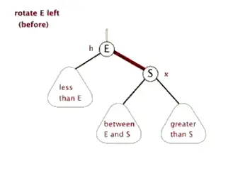
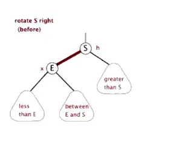
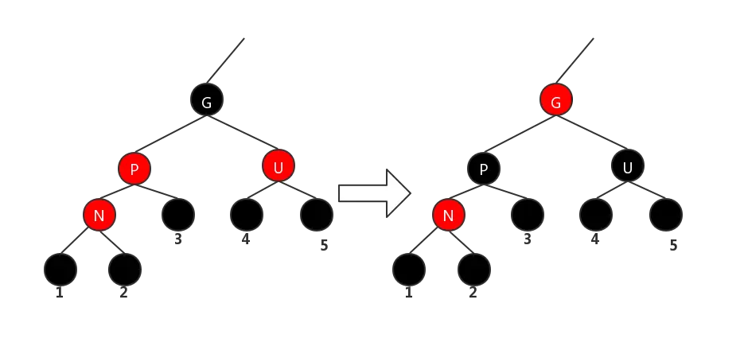
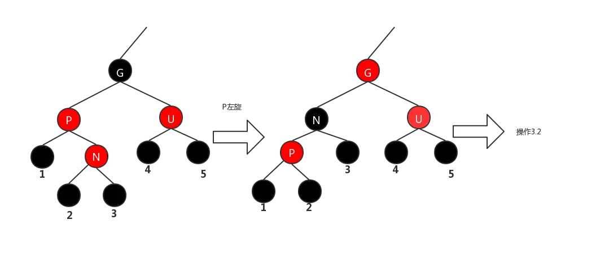
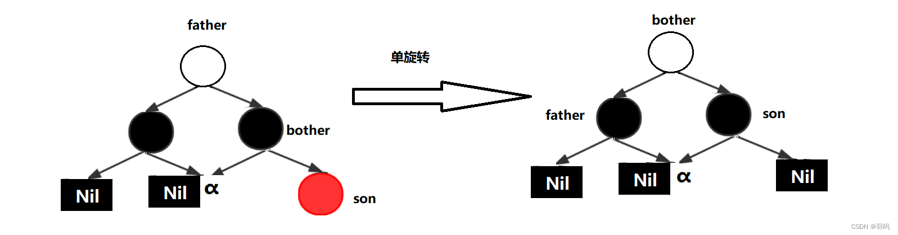
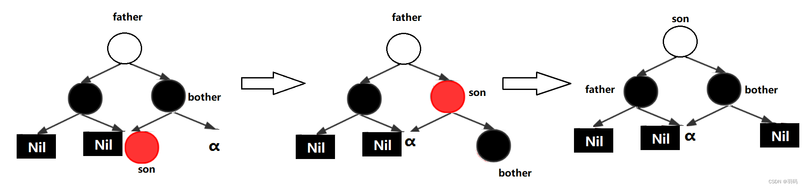
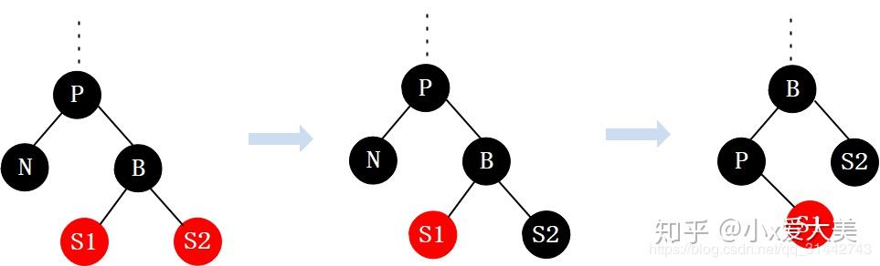
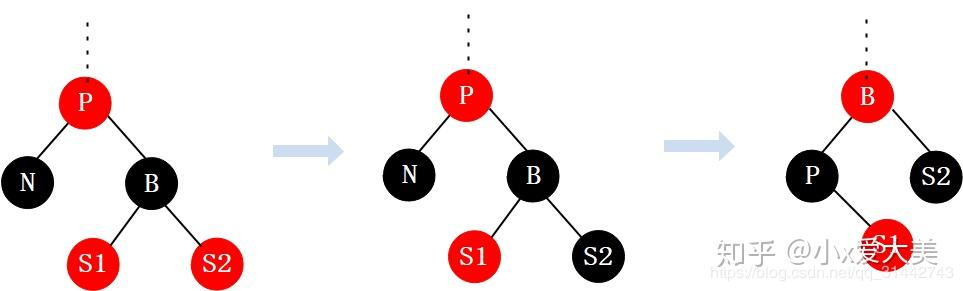
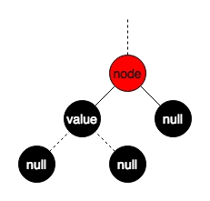
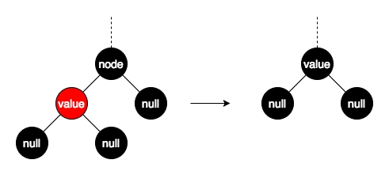

# 红黑树

一般的，红黑树同时满足以下五大特性：

1. 所有节点的颜色是红色或者黑色；
2. 根节点是黑色；
3. 所有的叶子节点是黑色（叶子节点包含NULL）；
4. 每个红色的节点都有两个黑色的子节点；
5. 从任意节点出发，到其所有叶子节点的简单路径上都包含相同数目的黑色节点.

> 红黑树中可能存在一个黑色父节点有两个黑色子节点或者一个红色一个黑色

平衡二叉树依靠旋转来平衡

## 添加节点

首先设添加的节点是红色节点，不为空节点，我们称为N节点。

分三种情况：

1. N节点是根节点
2. N节点的父节点是黑
3. N节点的父节点为红

解决方法

1. 直接变成黑色的根节点

2. 不需要操作，直接插入

3. 由于父节点是红色，所以它的祖父节点是黑色

   - 3.1 N的叔父节点是红色

     将父节点和叔父节点都刷成黑色，将祖父节点刷成红色，然后向上递推

     

   - 3.2 N的叔父节点是黑色或不存在，N和父节点同为左节点或同为右节点

     将G右旋，然后调换G、P颜色。之后向上递归

     

   - 3.3 N的叔父节点是黑色，N和父节点不同边

     将P左旋，变为3.2情况，再按照3.2调整

     

## 删除节点

删除节点的子节点状态和颜色的组合

### 问题场景

子节点状态共有3种：1. 无子节点；2. 有一个；3. 有两个。颜色分为红色和黑色，因此共有6个组合

1. 被删节点无子节点，且被删节点为红色
2. 被删节点无子节点，且被删节点为黑色
3. 被删节点有一个子节点，且被删节点为红色
4. 被删节点有一个子节点，且被删节点为黑色
5. 被删节点有两个子节点，且为红色
6. 被删节点有两个子节点，且为黑色

### 解决方法：

#### 组合一：

直接删除

#### 组合二：

这种情况比较复杂，分五种：

情形一：被删节点的兄弟节点为黑色，且其兄弟节点有孩子节点为红色,孩子为外侧
情形二：被删节点的兄弟节点为黑色，且其兄弟节点有孩子节点为红色，孩子为内侧
情形三：被删节点的兄弟节点为黑色，且其兄弟节点无孩子节点
情形四：被删节点的兄弟节点为红色，即它必有黑色的孩子节点
情形五：被删节点的兄弟节点为黑色，其兄弟节点的孩子节点都为红色，且不为Nil

- 被删节点兄弟节点是黑色，且兄弟节点子节点为红色，子节点在外侧。

左旋父节点，然后删掉当前节点。父节点变黑，兄弟节点继承父节点颜色，兄弟节点子节点继承兄弟节点黑色。

- 被删节点的兄弟节点为黑色，且其兄弟节点有孩子节点为红色，孩子为内侧

右旋兄弟节点，然后变成情形一，再左旋父节点，然后删掉当前节点

- 被删节点的兄弟节点为黑色，且其兄弟节点无孩子节点

又分父节点为黑色或红色

​		- 父节点是红色，删掉被删节点，要将删除节点的黑色转移到父节点，再把父节点的红色转移到兄弟节点

​		- 父节点是黑色，删掉被删节点，再把兄弟节点变成红色

- 被删节点的兄弟节点为红色，即它必有黑色的孩子节点和黑色的父节点

左旋父节点，删掉被删节点，父节点涂成红色，兄弟节点涂成黑色

- 被删节点的兄弟节点为黑色，其兄弟节点的孩子节点都为红色，且不为Nil

父节点颜色给兄弟节点，将兄弟节点右子节点设置为黑色，将父节点设置黑色，左旋父节点

#### 组合三：

这种情况不可能，不符合性质5

#### 组合四：

被删节点的另一个子节点必然是红色，直接将节点删掉，用子节点代替当前节点，子节点刷成黑色

#### 组合五：

将被删节点的值改为左子树的最大值或右子树的最小值，再把用来替换的节点删掉。

#### 组合六：

同组合五