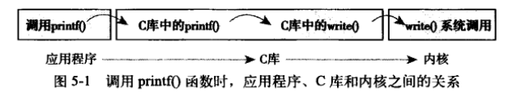

# 系统调用

内核提供的用户进程和内核进行交互的一组接口，让应用程序受限得访问设备。

## 与内核通信

系统调用是用户空间进程和硬件设备的中间层，主要作用有三个：

1. 提供硬件的抽象接口，不必关心具体实现
2. 保证系统稳定和安全。内核可以基于权限、用户类型和其他规则对访问进行裁决
3. 实现虚拟系统。如果用户空间可以随意访问硬件而内核不知道的话，就没法实现多任务和虚拟内存

系统调用是用户空间访问内核的唯一手段；除异常和陷入外，是内核唯一的合法入口。Linux提供的系统调用比大部分操作系统要少得多。

## API、POSIX和C库



Unix中，最流行的应用程序接口是基于POSIX标准的，其目标是提供一套大体上基于Unix的可移植操作系统标准。C库实现了Unix系统的主要API，包括标准C库和系统调用接口，提供了POSIX的绝大部分API。

内核只和系统调用打交道，库函数及应用程序怎么使用系统调用，不是内核所关心的。关于Unix接口设计有一句格言：**提供机制而不是策略**：“需要提供什么功能”（机制）和“怎样实现这些功能”（策略），需要区别对待。

## 系统调用

系统调用会返回long类型的返回值来表示成功或失败，为了32位与64位系统的兼容。

系统调用在出错时c库会把错误码写入errno全局变量，通过调用perror()库函数，可以把变量翻译成用户可以理解的错误字符串。

SYSCALL_DEFINE0是一个宏，定义了一个无参数的系统该调用（因此有数字0）

```
SYSCALL_DEFINE0(getpid) {}
// 展开后是
asmlinkage long sys_getpid(void) 
// asmlinkage 限定词是一个编译指令，告诉编译器仅从栈中提取该函数的参数，所有系统调用都需要这个限定词。
```

系统调用get_pid()在内核中被定义成sys_getpid()，这是Linux所有系统调用都应该遵守的命名规则。

### 系统调用号

Linux中每个系统调用都被赋予一个独一无二的系统调用号，用来指明执行哪个系统调用：进程不会提及系统调用的名称。

系统调用号很重要，一旦分配不再变更，否则编译好的应用程序就会崩溃或者使用错误的系统调用。即使删除某个系统调用也不允许回收。有一个“未实现”的系统调用sys_ni_syscall()，除返回-ENOSYS外不做任何工作，这个错误号专门针对无效的系统调用设计的。

内核记录了系统调用表所有已注册过的系统该调用列表，存储在sys_call_table中，在x86-64体系中，定义在arch/i386/kernel.syscall_64.c中，指定系统调用号。

### 系统调用的性能

Linux系统调用比其他操作系统执行的快，原因如下：

1. 进出内核都被优化得很简洁高效
2. 系统调用处理程序和系统调用本身也都非常简洁

## 系统调用处理程序

应用程序通过软中断通知系统，希望系统切换到内核态，这样内核就可以代表应用程序在内核空间执行系统调用。实现机制：通过引发一个异常来促使系统切换到内核态去执行异常处理程序。此处的异常处理程序实际上就是系统调用处理程序，x86系统上预定定义的中断号是128，通过指令`int $0x80`出发。异常处理程序名字叫system_call()，与硬件体系结构密切相关，x86-32系统上在entry_64.S中用汇编语言编写。最近，x86处理器增加了一条叫做sysenter的指令，与int中断指令相比，提供了更快、更专业的陷入内核执行系统调用的方式。

### 指定恰当的系统调用

在x86系统上，系统调用号是通过eax寄存器传给内核的。在陷入内核前，用户空间将系统调用号放入eax寄存器，系统调用程序一旦运行，就可以从eax中得到数据。

system_call()函数通过将给定的系统调用号与NR_syscalls做比较检查有效性，如果大于或等于NR_syscalls，就返回 -ENOSYS，否则执行：

```
call *sys_call_table(, %rax, 8)
```

游戏系统调用表项是64位8字节类型存放的，因此需要将给定的系统调用号乘以4，然后查询位置。在x86-32中类似，只是用4代替8.

 ### 参数传递

把参数也存放在寄存器上。在x86-32系统上，ebx、ecx、edx、esi和edi按顺序存放前五个参数，需要6个及以上的参数不多见，应该用一个单独的寄存器存放指向所有参数在用户空间地址的指针。给用户空间的返回值也存放在寄存器传递x86系统上存放在eax寄存器上。

## 系统调用的实现

### 实现系统调用

实现新的系统调用的步骤

1. 决定用途，要做什么。不提倡多用途的系统调用，即一个系统调用通过传递不同的参数值来选择完成不同的工作。
2. 参数、返回码和错误码是什么。力求简洁，参数尽可能少。力求稳定，不做改动。
3. 越通用越好。别对机器的字节长度和字节序做假设，

当写一个新系统调用时，要注意可移植性和健壮性，要为将来做打算。

### 参数验证

必须仔细检查参数是否合法，如文件描述符、PID、指针。内核必须保证：

1. 指针指向的内存区域属于用户空间
2. 指针指向的内存区域在进程的地址空间里
3. 绝不能绕过内存访问限制，如读写可执行。

内核提供了两个方法来完成必须的检查和内核空间与用户空间的来回拷贝，内核无论何时都不能轻率接受来自用户空间的指针。

1. 为向用户空间写数据，内核提供了copy_to_user()，需要三个参数，第一个参数是进程空间的目的内存地址，第二个是内核空间的源地址，最后一个参数是需要拷贝的数据长度（字节数）
2. 为从用户空间读数据，内核提供了copy_from_user()，与copy_to_user()类似，也是三个参数。

如果执行失败，两个函数返回的都是没能完成拷贝的字节数，否则返回0。出错时系统调用返回标准 -EFAULT。

这两个函数都可能会引起阻塞：当包含用户数据的页被换出到硬盘上而不是内存页上的时候，这种情况就会发生。此时进程休眠，知道缺页处理程序将该页从硬盘重新换回物理内存。

使用capable()函数检查是否有权限，若非0，调用者就有权限进行错做，否则无权限。如capable(CAP_SYS_NICE)检查是否有权改变其他进程的nice值，CAP_SYS_REBOOT是否有权重启。

## 系统调用上下文

内核在执行系统调用的时候处于进程上下文，current指针指向引发系统调用的进程。

在进程上下文中，内核可以休眠并且被抢占，这两点很重要：

1. 能休眠说明系统调用可以使用内核提供的绝大部分功能
2. 能被抢占说明新进程可以使用相同的系统调用，所以要保证该系统调用是可重入的。

当系统调用返回时，控制权仍在system_call()中，它最终会负责切换到用户空间。

### 绑定一个系统调用的最后步骤

1. 在系统调用表中最后加入一个表项（大多数体系结构中，该表位于entry.s文件中）
2. 对于所支持的各体系结构，系统调用号都必须定义在`<asm/unistd.h>`中
3. 系统调用必须被编译进内核印象（不能编译成模块），这只要把它放在kernel/下的一个相关文件中就可以，比如sys.c，它包含了各种各样的系统调用，可以把系统调用的接口在该文件中实现。也可以放在kernel/sched.c中等。
4. 之后就可以启动内核并在用户空间调用自定义的系统调用了。

### 从用户空间访问系统调用

通常系统调用靠C库实现，通过包含标准头文件并和C库链接就可以调用，但自定义的并不提供支持。

Linux本身提供了一组宏，用于直接对系统调用进行访问，会设置好寄存器并调用陷入指令。这些宏是`__syscalln()`，其中n的范围是从0到6，代表传给系统调用的参数个数，这是由于该宏必须了解到底有多少参数按照什么次序压入寄存器。例如，open()系统调用的定义是：

```
long open(const char *filename, int flags, int mode)
```

而不靠库支持，直接调用该系统调用的宏的形式为

```
#define NR_open 5
__syscall3(long, open, const char*, filename, int, flags, int, mode)
```

对每个宏来说，都有`2+2xn`个参数，第一个参数对应返回值类型，第二个参数是系统调用名称。后面是按照系统调用参数顺序排列的每个参数的类型和名称。_NR_open是在`<asm/unistd.h>`中定义的系统调用号。该宏会被扩展成内嵌回边的C函数。

### 为什么不通过系统调用的方式实现

建立新系统调用很容易，但绝不提倡这么做。让我们看看采用系统调用作为实现方式的利弊和代替的方法：

- 建立一个新系统调用的好处：
  - 系统调用创建容易且使用方便
  - Linux系统调用的高性能显而易见
- 问题是
  - 需要一个系统调用号，但需要一个内核在处于开发版本的时候由官方分配给你
  - 系统调用被加入稳定内核后就被固化了，为避免程序崩溃，接口不允许改动
  - 需要将系统调用分别注册到每个需要支持的体系结构中
  - 脚本不容易调用系统调用，也不能从文件系统直接访问系统调用
  - 由于需要系统调用号，因此在主内核树外很难维护和使用系统调用
  - 如果仅仅是简单的信息交换，系统调用就大材小用了
- 替代方法
  - 实现一个设备节点，并对其实现read()和write()，使用ioctl()对特定的设置进行操作或对特定信息进行检索
  - 像信号量这样的某些接口可以用文件描述符表示
  - 把增加的信息作为一个文件放在sysfs的合适位置。

Linux系统尽量避免每出现一个新的抽象就简单的加入一个新系统调用，这使得它的系统调用接口简洁得令人叹为观止。新系统调用增添频率很低也反应出Linux是一个相对较为稳定并且功能已经较为完善的操作系统。
