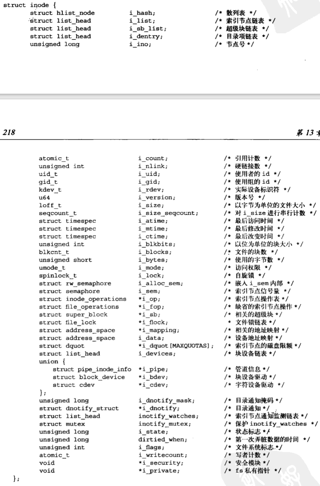

# 虚拟文件系统

简称VFS，作为内核子系统，为用户空间提供了文件和文件系统相关的接口。系统中所有文件系统不但依赖VFS，而且依靠VFS系统协同工作。通过虚拟文件系统，程序可以利用标准的Unix系统调用对不同的文件系统，甚至不同介质上的文件系统进行读写操作。

例如ext3文件格式和ext2文件格式互传。

## 通用文件系统接口

系统调用额可以在不同的文件系统和不同介质执行，可以用标准的系统调用从一个文件系统拷贝或移动数据到另一个文件系统。正式由于现代操作系统引入抽象层，比如Linux，通过虚拟接口访问文件系统，才使得这种协作性和泛型成为可能。

## 文件系统抽象层

为支持多文件系统，VFS提供了一个通用文件系统模型，该模型囊括了任何文件系统的常用功能集和行为。从DOS系统的FAT到Windows系统的NTFS，再到各种Unix风格文件系统和Linux特有的文件系统。

实际文件系统通过编程提供VFS所期望的抽象接口和数据结构。在内核中，除文件系统外，其他部分不需要了解文件系统的内部细节。比如用户空间执行如下的操作：

```c
ret = write(fd, buf, len);
```

将buf指针指向的长度为len字节的数据写入fd文件的当前位置。这个系统调用首先被一个通用系统调用sys_write()处理，它要找到fd所在的文件系统实际给出的是哪个写操作，然后再执行该操作。

## Unix文件系统

Unix使用了四种和文件系统相关的传统抽象概念：文件、目录项、索引节点和安装点（mount point）。

本质上讲文件系统是特殊的数据分层存储结构，包含文件、目录和相关的控制信息。文件系统的通用操作包含创建、删除和安装等。在Unix中，文件系统被安装在一个特定的安装点上，该安装点在全局层次结构中被称作命名空间，所有已安装文件系统都作为根文件系统树的枝叶出现在系统中。

文件骑士可以看作一个有序字节串。典型的文件操作有读、写、创建和删除等。Unix文件的概念和面向记录的文件系统形成鲜明对比，面向记录的文件系统提供更丰富、更结构化的表示，而面向字节流抽象的Unix文件则以简单性和相当的灵活性为代价。

路径中的每一部分都被称作目录条目。在Unix中，目录属于普通文件，它列出包含其中的所有文件。由于VFS把目录当作文件对待，所以可以对目录执行和文件相同的操作。

Unix系统将文件的相关信息和文件本身这两个概念加以区分，例如访问控制权限、大小、拥有者、创建时间等信息。文件相关信息，有时被称作**文件的元数据（文件的相关数据）**，被储存在一个单独的数据结构中，该结构被称为索引节点（inode），是index node的缩写。

**文件系统的控制信息**存储在超级块中，超级块是一种包含文件系统信息的数据结构。有时把这些收集起来的信息称为**文件系统数据元**，集**单独文件信息**和**文件系统的信息**于一身。

比如在磁盘上，文件信息按照索引节点形式存储在单独的块中；控制信息被集中存储在磁盘的超级块中。

1. 像FAT和NTFS这样的非Unix风格的文件系统，虽然可以在Linux上工作，但必须经过封装，提供一个符合这些概念的界面。即使一个文件系统不支持索引节点，也必须在内存中装配索引节点结构体，就像它本身包含索引节点一样。
2. 再比如，如果一个文件系统将目录看作一种特殊对象，那么想使用VFS，必须将目录重新表示为文件形式。这种转换需要在使用现场引入一些特殊处理，但是其带来的开销太大。

## VFS对象及其数据结构

VFS采用的是面向对象的设计思路，使用一组数据结构来代表通用文件对象。内核数据结构都使用C语言的结构体实现，这些结构体也包含操作这些数据的函数指针，其中操作函数由具体文件系统实现，

VFS中有四个主要的对象类型：

1. 超级块对象，它代表一个具体的已安装文件系统；
2. 索引节点对象，它代表一个具体文件；
3. 目录项对象，代表一个目录项，是路径的一个组成部分；
4. 文件对象，代表由**进程打开的文件**；

VFS将目录作为文件处理，所以不存在目录对象，目录项代表的是路径中的一个组成部分，它可能包含一个普通文件，**目录项不同于目录**。

每个主要对象中都包含一个操作对象，这些操作对象描述了内核针对主要对象使用的方法：

1. super_operations对象，其中包括内核针对特定文件系统所能调用的方法，比如write_inode()和sync_fs()等方法；
2. inode_operations对象，其中包括内核针对特定文件所能调用的方法，如create()和link()；
3. dentry_operations对象，其中包括内核针对特定目录所能调用的方法。，如d_compare()和d_delete()；
4. file_operations对象，包括进程针对已打开文件所能调用的方法，比如read()和write()等；

对于其中的很多方法来说，可以继承使用VFS提供的通用函数，如果通用函数提供的基本功能无法满足需要，那么就必须使用实际文件系统的独有方法填充这些函数指针，使其指向文件系统实例。

## 超级块对象

各种文件系统都必须实现超级块对象，该对象用于存储特定文件系统的信息，通常对应于存放在磁盘特定扇区中的文件系统超级块或文件系统控制块。对于并非基于磁盘的文件系统（如基于内存的文件系统，比如sysfs），会在**使用现场**创建超级块并将其保存在内存中。

超级块对象由super_block结构体表示，定义在文件`<linux/fs.h>`中


创建、管理和撤销超级块对象的代码位于文件fs/super.c中。超级块对象通过alloc_super()函数创建并初始化。在文件系统安装时，文件系统会调用该函数从磁盘读取文件系统超级块，并**将其信息填充到内存中的超级块对象**中。

## 超级块操作

超级块对象中最重要的一个域是s_op，指向超级块的操作函数表，由super_operations结构体表示，定义在文件`<linux/fs.h>`中：


尽管超级块操作函数如（write_super()）来自超级块，但在调用时，还是要把超级块作为参数传递给它，这是因为C语言缺少面向对象的支持。由于C语言无法直接得到操作函数的父对象，所以必须将父对象以参数像是传给操作函数。所有以上函数都是由VFS在进程上下文中调用，除dirty_inode()，其他函数在必要时可以阻塞。

其中一些函数是可选的，可以将不需要的函数指针设置为NULL；

## 索引节点对象

对于Unix风格的文件系统来说，操作文件和目录的信息可以**从磁盘索引节点直接读入**。没有索引节点的文件系统通常将文件的描述信息作为文件的一部分来存放。没有将数据和控制信息分开存放。不管哪种情况，采用何种方法，索引节点对象必须在内存中创建，以便文件系统使用。

索引节点对象由inode结构体表示，它定义在文件`<linux/fs.h>`中



索引节点结构体中有一些和特殊文件相关项，如i_pipe项就指向一个代表有名管道的数据结构，i_bdev指向块设备结构体，i_cdev指向字符设备结构体。这三个指针被存放在一个公用体中，因为inode每次只能代表三者之一或者三者全不。

某些文件系统可能并不完整地包含索引节点结构体要求的全部信息。该文件系统可以在实现中选择任意合适的办法来解决这个问题，可以在i_atime中存储为0，或者等于i_mtime或者只在内存中更新i_atime而不写回磁盘，或者由文件系统的实现者来决定。

## 索引节点操作

inode_operations结构体定义在文件`<linux/fs.h>`中


## 目录项对象

VFS把目录当作文件对待，所以在路径/bin/vi中，bin和vi都属于文件，路径中的每个组成部分都由一个索引节点对象。为方便查找操作，VFS引入目录项概念，每个dentry代表路径中的一个特定部分。对前一个例子来说，`/`、bin和vi都属于目录项兑现给。必须明确一点：在路径中，每一部分都是目录项对象。目录项的引入使解析路径并遍历其分量更加简单。

目录项也可包括安装点。VFS在执行目录操作时（如果需要的话）会现场创建目录项对象。

目录项对象由dentry结构体表示，定义在文件`<linux/dcache.h>`中：


与前面两个对象不同，目录项对象没有对应的磁盘数据结构，VFS会根据字符串形式的路径名现场创建它。

> 为什么不直接用inode表示文件，还需要dentry？不都是指向同一个文件吗？
>
> dentry代表的是一个逻辑意义上的文件，描述的是文件逻辑意义上的属性；而inode代表的是物理意义上的文件，记录的是物理上的属性。一个索引节点对象可能对应多个目录项对象。这是因为一个已经建立的文件可以被连接（link）到其他文件名。所以在inode结构中有一个队列i_dentry，凡是代表着同一个文件的所有目录项都通过其dentry结构中的d_alias域挂入相应inode结构中的i_dentry队列。
>
> 一个文件系统中所有目录项结构或组织为一个哈希表，或组织为一颗树，或按照某种需要组织为一个链表，这将为文件访问和文件路径搜索奠定下良好的基础。
>
> **关键：**inode仅仅保存文件对象的属性信息，包括权限、物理位置、时间戳等。但没有包含文件名和文件在文件系统目录树中所处的位置。目录项通过给每个文件设置位置，在内核中起到了连接不同文件对象inode的作用，进而起到维护文件系统目录树的作用。

### 目录项状态

目录项对象有三种有效状态：被使用、未被使用和负状态。

1. 被使用状态的目录项对应一个有效的索引节点（d_inode指向），并表明该对象存在一个或多个使用者（d_count为正值），意味着它正被VFS使用并且指向有效数据，因此不能被丢弃。
2. 未被使用状态对应一个有效的索引节点，但是应指明VFS当前未使用它（d_count为0），而且被保留在缓存中以便需要时再使用它。如果要回收内存的话，可以撤销未使用的目录项。
3. 负状态的目录项没有对应的有效索引节点（d_inode为NULL），因为索引节点已被删除，或路径不正确，但目录项仍保留。比如一个守护进程不断地去尝试打开并读取一个不存在的配置文件。直到内核构建了这个路径、遍历磁盘上的目录结构体并检查这个文件的确不存在为止。虽然负状态的目录项有些用处，但是如果有需要可以撤销它。

目录项对象释放后也可以保存到slab对象缓存中。

### 目录项缓存

如果VFS层遍历路径名中所有的元素并将它们逐个解析成目录项对象，还要到达最深层目录，会浪费大量时间。所以内核将目录项对象缓存在目录项缓存中（简称dcache）。

目录项缓存包括三个主要部分：

1. 被使用的目录项链表。该链表通过索引节点对象中的i_dentry项连接相关的索引节点。一个索引节点可能有多个链接，所以就可能有多个目录项对象，因此用一个链表来连接他们。
2. 最近被使用的双向链表。该链表还有未被使用和负状态的目录项对象，由于采用头插法，因此链头数据要比链尾数据新。当内核必须要回收内存时，会从链尾删除节点项。
3. 散列表和相应的散列函数用来快速地将给定路径解析为相关目录项对象

散列表由数组dentry_hashtable表示，其中每个元素都是指向具有相同键值的目录项对象链表的指针。数组大小取决于物理内存大小。实际的散列值由d_hash()函数计算，它是内核提供给文件系统唯一的一个散列函数。查找散列表要通过d_lookup()函数。

dcache在一定意义上也提供了对索引节点的缓存，也就是icache。和目录项对象相关的索引节点对象不会被释放，因为目录项会让相关索引节点的使用计数为正，这样就可以保证索引节点留在内存中，只要目录项被缓存，其索引节点也就被缓存。

## 目录项操作

dentry_operations定义在文件`<linux/dcache.h>`中


## 文件对象

文件对象表示进程已经打开的文件。文件对象包含我们非常熟悉的信息（如访问模式，当前偏移等），文件操作也和我们非常熟悉的系统调用read()和write()等类似。

文件对象是已打开的文件在内存中的表示。该对象由相应的open()系统调用创建，close()系统调用撤销，所有这些相关调用都是文件操作表中定义的方法。因为多个进程可以同时打开和操作同一个文件，所以一个文件可能存在多个文件对象。文件对象仅在进程观点上代表已打开文件，它反过来指向目录项对象（反过来指向索引节点），只有目录项对象才表示已打开的实际文件。

文件对象由file结构体表示，定义在文件`<linux/fs.h>`中


文件对象没有实际上对应的磁盘数据。文件对象通过f_dentry指针指向相关的目录项对象，目录项会指向相关的索引节点。

## 文件操作

file_operations定义在文件`<linux/fs.h>`中


## 和文件系统相关的数据结构

除以上VFS基础对象外，内核还是用了另外一些标准数据结构来管理文件系统的其它相关数据。第一个对象是file_system_type，用来描述各种特定文件系统类型，比如ext3、ext4或UDF。第二个结构体是vfsmount，用来描述一个安装文件系统的实例。

内核必须由一个特殊的结构来描述每种文件系统的功能和行为。file_system_type结构体被定义在`<linux/fs.h>`中


get_sb()函数从磁盘拂去超级块，并且在文件系统被安装时，在内存中组装超级块对象。每种文件系统，不管由多少个实例安装到系统中，还是根本没有安装到系统中，都只有一个file_system_type结构。当文件系统被实际安装时，将有一个vfsmount结构体在安装点被创建。该结构体用来表示文件系统的实例，代表一个安装点。

vfsmount被定义在文件`<linux/mount.h>`中。


理清文件系统和所有其他安装点间的关系，是维护所有安装点链表中最复杂的工作，所以vfsmount结构体中维护的各种链表就是为了能够跟踪这些关联信息。

## 和进程相关的数据结构

每个进程都有字节的一组打开的文件，像根系统文件、当前工作目录、安装点等。有三个数据结构将VFS层和系统的进程紧密联系在一起，它们分别是：file_struct、fs_struct和 namespace 结构体。

file_struct结构体定义在文件`<linux/fdtable.h>`中。该结构体由进程描述符中的files目录项指向。所有与单个进程相关的信息都包含着其中：


fd_array数组指针指向已打开的文件对象。因为NR_OPEN_DEFAULT等于BITS_PER_LONG，在64位机器体系结构中这个宏的值是64，所以该数组可以容纳64个文件对象。如果超过64，内核将分配一个新数组，并且将fdt指针指向它。因为是静态数组，所以对适当数量的文件对象的访问会执行很快。如果进程打开的文件数量过多，内核就需要简历新数组。如果系统中由大量的进程都要打开超64个文件，为优化性能，管理员可适当增大NR_OPEN_DEFAULT的预定义值。

fs_struct结构体由进程描述符的fs指向。包含文件系统和进程相关的信息，定义在文件`<linux/fs_struct.h>`中


namespace结构体定义在文件`<linux/mmt_namespace.h>`中，由进程描述符中的mmt_namespace指向。在2.4内核之后，单进程命名空间被加入到内核中，它使得每一个进程在系统中都能看到唯一的安装文件系统——不仅是唯一的根目录，而且是唯一的文件系统层次结构。


list是连接已安装文件系统的双向链表，包含的元素组成了全体命名空间。

上述结构都是通过进程描述符连接起来。对多数进程来说，它们的描述符都指向唯一的files_struct和fs_struct结构体，但是对于使用克隆标志CLONE_FILE或CLONE_FS创建的进程，会共享。每个结构体维护一个count作为引用计数，防止进程正使用该结构时，该结构被撤销。

namespace结构体的使用方法和前两种结构体不同，默认情况下，所有进程共享同样的命名空间（它们从相同的挂载表中看到同一个文件系统层次结构）。只有进行clone()操作使用CLONE_NEWS标志，才会给进程一个唯一的命名空间结构体的拷贝。因为大多数进程不提供这个标志，所有进程都继承父进程的命名空间。因此在大多数系统上只有一个命名空间。