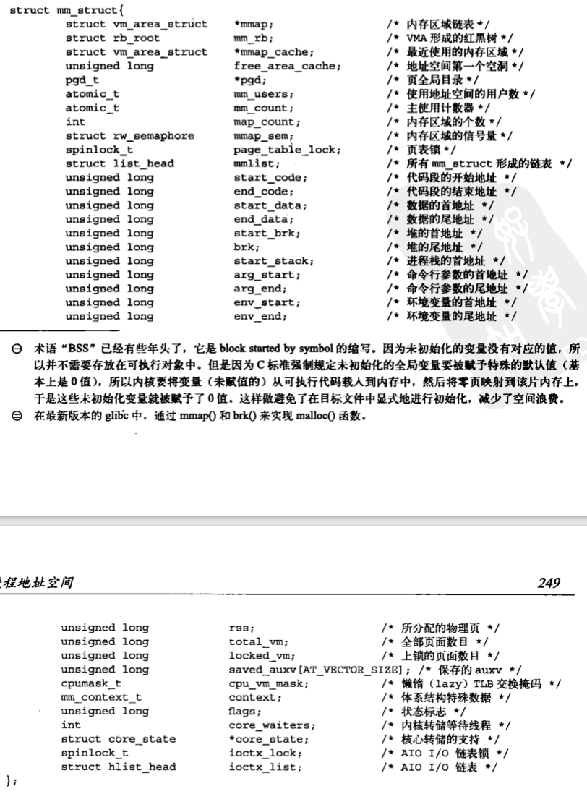
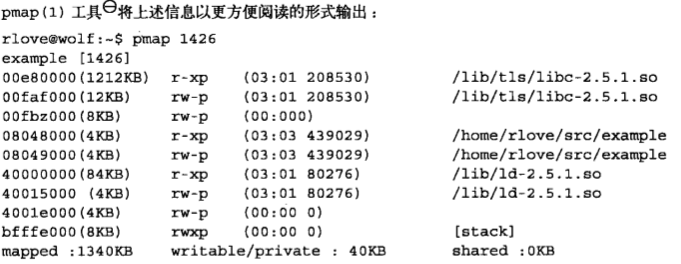
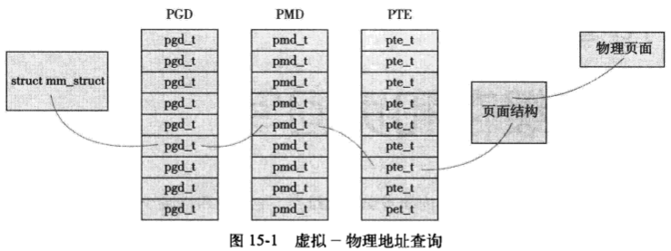

# 进程地址空间

系统中每个用户空间进程能看到的内存。Linux操作系统采用虚拟内存技术。因此，所有进程以虚拟方式共享内存。

## 地址空间

现代采用虚拟内存的操作系统都使用平坦地址空间而不是分段式的内存模式。一个进程的地址空间即使与另一个进程的地址空间即使有相同的内存地址，实际上彼此互不相干，我们称这样的进程为线程。

在地址空间中，我们更为关心的是一些虚拟内存的地址空间，它们可被进程访问。这些**可被访问的合法地址空间称为内存区域**。通过内核，进程可以给字节的地址空间动态地添加或减少内存区域。进程只能访问有效内存区域内的内存地址。如果进程访问了不在有效范围内的内存区域，或者以不正确的方式访问了有效地址，那么内核就会终止该进程，并返回“段错误”信息。

内存区域可以包含各种内存对象：

1. 可执行文件代码的内存映射，称为代码段
2. 可执行文件的已初始化全局变量的内存映射，称为数据段
3. 包含未初始化全局变量，也就是bss段的零页（页中全部为0）的内存映射
4. 用于进程用户空间栈（与进程内核栈分开）的零页的内存映射。
5. 每一个C库或动态连接程序等共享库的代码段、数据段、bss也会载入进程的地址空间
6. 任何内存映射文件
7. 任何内存共享段
8. 任何匿名的内存映射，比如malloc()分配的内存

## 内存描述符

内核使用内存描述符结构体表示进程的地址空间。内存描述符由mm_struct结构体表示，定义在文件`<linux/sched.h>`中。



1. mm_users记录正在使用该地址的进程数。比如两个线程共享该地址空间，那么mm_users的值等于2。
2. mm_count是主引用计数。所有mm_users都等于mm_count的增加量**（？？？）**。1中的例子mm_count的值是1。如果有9个线程共享某个地址空间，那么mm_users将会是9，而mm_count的值再次**（为什么说再次？？？变化了吗？？？）**为1。当mm_users的值减为0，mm_count的值才变成0，说明已经没有任何指向该地址相关联的应用计数了。
3. mmap和mm_rb这两个描述的对象是相同的：该地址空间中的全部内存区域。但前者是以链表形式存放，后者以红黑树的形式存放。内核通常会避免两种数据结构组织同一种数据，但此刻内核这样的冗余确实派的上用场。链表利于简单高效地遍历所有元素；红黑树适合搜索指定元素。内核并没有复制mm_struct结构体，仅仅被包含其中。覆盖树上的链表并用这两个结构体同时访问相同的数据集，我们将此操作称为线索树。

所有mm_struct结构体都通过自身的mmlist连接在一个双向链表中，链首元素是init_mm内存描述符，它代表init进程的地址空间。操作该链表的时候需要使用mmlist_lock锁防止并发访问，该锁定义在文件kernel/fork.c中。

### 分配内存描述符

进程描述符中，mm变量存放该进程使用的内存描述符。fork()函数利用copy_mm()复制父进程的内存描述符，子进程中的mm_struct结构体是通过文件kernel/fork.c中的allocate_mm()宏从mm_cachep slab缓存中分配得到的。

如果父进程希望和子进程共享地址空间，可以在调用clone()时，设置CLONE_VM标志。把这样的进程称为线程。是否共享地址空间几乎是进程和Linux所谓线程间本质的唯一区别。当CLONE_VM被指定后，内核不再调用allocate_mm()函数，而仅仅在调用copy_mm()函数将mm域指向父进程的内存描述符即可。

### 撤销内存描述符

当进程退出时，内核会调用kernel/exit.c中的exit_mm()函数。该函数会调用mmput()减少内存描述负中的mm_users。如果降到0，将调用mmdrop()，减少mm_count使用计数，如果使用计数也降到0，调用free_mm()通过kmem_cache_free()将mm_struct归还到mm_cachep slab缓存中。

### mm_struct与内核线程

**内核线程没有进程地址空间，也没有相关的内存描述符。所以内核线程对应的进程描述符中mm变量为空。事实上，这也正是内核线程的真实含义——它们没有用户上下文。**

内核线程在用户空间中没有任何页（**内核有自己专门的内存地址，只有一处，所有用户共享**），并不需要字节的内存描述符和页表。尽管如此，即使访问内核内存，内核线程也还是需要使用一些数据的，比如页表。为避免内核线程为内存描述符和页表浪费内存，也为了避免新内核线程浪费处理器周期向新地址空间进行切换，内核线程将直接使用前一个进程的内存描述符。

当一个内核线程被调度时，内核发现它的mm域为NULL，就会保留前一个进程的地址空间，随后内核更新内核线程对应的进程描述符中的active_mm域，使其指向前一个进程的内存描述符。在需要时，可以使用前一个进程的页表。因为内核线程不访问用户空间的内存，所以它们仅仅使用地址空间中和内核内存相关的信息，这些信息的含义和普通进程完全相同。

## 虚拟内存区域

内存区域由vm_area_struct结构体描述，定义在文件`<linux/mm_types.h>`中，内存区域在Linux内核中也经常称作虚拟内存区域（VMAs）

vm_area_struct描述了指定地址空间内连续区间上的一个独立内存范围。内核将每个内存区域作为一个单独的内存对象管理。每一个VMA就可以代表不同类型的内存区域（比如内存映射文件或者进程用户空间栈）。这种方式类似于使用VFS层的面向对象方法。

每个内存描述符都对应于进程空间中的唯一区间。vm_start域指向区间的首地址（低地址），vm_end指向尾地址（高地址）。vm_end - vm_start 就是内存区间的长度。**在同一个地址空间内的不同内存区间不能重叠**。

vm_mm域指向和VMA相关的vm_struct结构体。每个VMA对相关的mm_struct结构体来说是唯一的，即使两个独立的进程将同一个文件映射到各自的地址空间，它们分别都会有一个vm_area_struct结构体来标志自己的内存区域；如果两个线程共享一个地址空间，它们也同时共享其中的所有vm_area_struct结构体。

### VMA标志

是一种位标志，定义见`<linux/mm.h>`。包含着vm_flags域内，标志了内存区域包含的页面的行为和信息。vm_flags同时也包含了内存区域中每个页面的信息，或内存区域的整体信息，而不是具体的独立页面。

1. VM_READ、VM_WRITE、VM_EXEC标志了内存区域中页面的读、写和执行权限。

2. VM_SHARD指明内存区域包含的映射是否可以在多进程间共享，设置则称为共享映射，未设置称为私有映射。

3. VM_IO标志内存区域中包含对设备I/O空间的映射。该标志通常在设备驱动程序执行mmap()函数进行I/O空间映射时才被设置，同时该标志也表示该内存区域不能被包含着任何进程的存放转存。
4. VM_RESERVED标志规定内存区域不能被换出，在设备驱动设备进行映射时被设置
5. VM_SEQ_READ暗示内核应用程序对映射内容执行有序（线性和连续的）读操作；此时内核可以有选择地执行预读文件。VM_RAND_READ标志的意义正好相反，暗示应用程序对映射内容执行随机的读操作。因此内核可以选择减少或彻底取消文件预读。可以通过系统调用madvise()设置，设置参数分别是MADV_SEQUENTIAL和MADV_RANDOM。

### VMA操作

vm_area_struct结构体中的vm_ops指向与指定区域相关的操作函数表，内核使用表中的方法操作VMA。操作函数表由vm_operations_struct结构体表示，定义在文件`<linux/mm.h>`中。

```c
struct vm_operations_struct {
    void (*open) (struct vm_area_struct *);
    void (*close) (struct vm_area_struct *);
    int (*fault) (struct vm_area_struct *, struct vm_fault *);
    /* 当 “没有出现在物理内存中的页面” 被访问时，该函数被页面故障处理调用 */
    int (*pg_mkwrite) (struct vm_area_struct *vma, struct vm_fault *vmf);
    int (*accrss) (struct vm_area_struct *, unsigned long, void *, int, int);
    
}
```

### 内存区域的树形结构和内存区域的链表结构

1. mmap使用单独的链表连接所有内存区域，**每个vm_area_struct结构体通过自身的vm_next连入链表**。
2. mm_rb指向红黑树的根节点，**每一个vm_area_struct通过自身的vm_rb连接到树中**。

### 实际使用中的内存区域

可以使用/proc文件系统和**pmap(1)工具**查看给定进程的内存空间和其中所含的内存区域。

`/proc/<pid>/maps`的输出显示进程地址空间中全部内存区域

每行数据格式如下：

```
开始-结束	访问权限	偏移	主设备号:次设备号	i节点	文件
```



1. 前三行分别对用C库中lic.so的代码段、数据段和bss段
2. 接下来两行是可执行对象的代码段和数据段
3. 接下来三行是动态连接程序ld.so的代码段、数据段和bss段
4. 最后一行是进程的栈

对于共享的不可写内存区域，只需要把映像读入一次，所以C库在物理内存中仅仅占用1212KB空间，**不需要为每个使用C库的进程都保存一个1212KB的空间**。进程虽可以访问1340KB的区域，仅仅消耗了40KB的物理内存。

没有映射文件的内存区域的设备标志为00：00，索引节点标志也为0，这个区域就是零页——零页映射内容全为0。由于内存未被共享，所以只要一有进程写该处数据，那么该处数据就被拷贝出来，然后才被更新。

进程不同于线程，进程结构体task_struct包含唯一的mm_struct结构体引用。

## 操作内存区域

内核经常需要在某个内存区域上执行一些操作，比如把某个指定地址是否包含在某个内存区域中。这类操作非常频繁，也是mmap()例程的基础。为方便这类对内存区域的操作，内核定义了需要的辅助函数，声明在文件`<linux/mm.h>`中。

### find_vma()

该函数定义在文件`<mm/mmap.h>`中

```c
struct vm_area_struct *find_vma(struct mm_struct *mm, unsigned long addr);
```

在指定的地址空间中寻找第一个包含addr或首地址大于addr的内存区域，如果没有发现这样的区域，返回NULL；由于返回的VMA首地址可能大于addr，所有指定的地址不一定包含在返回的VMA中。find_vma()函数返回的结果被缓存在内存描述符的mmap_cache中。实践证明，被缓存的VMA有相当好的命中率，而且检查被缓存的VMA速度会很快。

1. 函数检查mm->mmap_cache缓存是否包含所需vma；
2. 如果不包含，则搜索mm->mm_rb红黑树，返回大于addr的第一个VMA；

### find_vma_prev()

和find_vma()的工作方式相同，但返回第一个小于addr的VMA，该函数定义和声明分别在文件mm/mmap.c和文件`<linux/mm.h>`中：

```c
struct vm_area_struct *find_vma_prev(struct mm_struct *mm,
                                    unsigned long addr,
                                    struct vm_area_struct **pprev)
```

pprev存放指向先于addr的VMA指针。

### find_vma_intersection()

返回第一个和指定地址区间香蕉的VMA，该函数的内联函数，定义在文件`<linux/mm.h>`中

```c
static inline struct vm_area_struct *find_vma_intersection(struct mm_struct *mm,
                                                          unsigned long strat_addr,
                                                          unsigned long end_addr)
{
    struct vm_area_struct *vma;
    
    vma = find_vma(mm, start_addr);
    if (vma && end_addr <= vma->vm_start)
        vma = NULL;
    return vma;
}
```

## mmap()和do_mmap()：创建地址空间

内核使用do_mmap()函数创建一个新的线性地址空间，但是如果创建的地址区间和一个已经存在的地址区间相邻，并且具有相同的访问权限的话，两个区间将合并为一个。函数定义在文件`<linux/mm.h>`中。

```c
unsigned long do_mmap(struct file *file, unsigned long addr,
                     unsigned long len, unsigned long prot,
                     unsigned long flag, unsigned long offset)
```

1. 映射由file指定的文件，具体映射的是文件中从偏移offset处开始的，长度为len字节范围内的数据。如果file为NULL且offset为0，代表这次映射没有和文件相关，称为匿名映射。如果指定文件名和偏移量，该映射是文件映射；
2. addr是可选参数，指定空闲区域起始位置；
3. prot指定内存区域中页面的访问权限；
4. flag指定VMA标志

如果系统调用do_mmap()的参数中有无效参数，那么它返回一个负值；否则，会在虚拟内存中分配一个合适的新内存区域。如果没有合并相邻区域，内核从vm_area_cachep长字节（slab）缓存中分配一个vm_area_struct结构体，使用vma_link()将新分配内存区域添加到内存区域链表和红黑树中，随后更新内存描述符中的total_vm，然后才返回新分配空间的初始地址。

用户空间可以通过mmap()系统调用获取内核函数do_mmap()的功能

```c
void *mmap2(void *start,
           size_t length,
           int prot,
           int flag,
           int fd,
           off_t pgoff)
```

由于是mmap()的第二种变种，所以命名为mmap2。使用页面偏移作最后一个参数。使用页面偏移量可以映射更大的文件和更大的偏移位置。

## mummap()和do_mummap()：删除地址区间

do_mummap()定义在文件`<linux/mm.h>`中：

```c
int do_mummap(struct mm_start *mm, unsigned long start, size_t len)
```

第一个参数指定要删除区域的地址空间，删除从地址start开始，长度为len字节的地址区间。如果成功，返回零，否则返回负的错误码。

系统调用mummap()给用户空间提供了一种从自身地址空间删除指定地址区间的方法

```c
int mummap(void *start, size_t length)
```

定义在文件 mm/mmap.c 中，是对 do_mummap()函数的一个简单封装。

## 页表

地址转换工作通过查询页表才能完成。概括地讲，地址转换需要讲虚拟地址分段，使每段虚拟地址都作为一个索引指向页表，而页表则指向下一级页表或指向最终的物理页面。

Linux中使用三级页表完成地址转换。利用多级页表可以节约地址转换需占用的存放空间。Linux对所有体系结构，包括那些不支持三级页表的体系结构都使用三级页表管理，因为使用三级页表结构可以利用 “最大公约数” 的思想，按照需要在编译时简化使用页表的三级结构，比如只使用两级

1. 顶级页表是页全局目录（PGD），包含一个 pdg_t 类型的数组，多数体系结构中 pdg_t 类型等同于无符号长整形类型。PGD 中的表项指向二级页目录中的表项：PMD；
2. 二级页表是中间页目录（PMD），是个 pmd_t 类型数组，其中表项指向 PTE 中的表项；
3. 最后一级的页表简称为页表，其中包含了 pte_t 类型的页表项，该页表项指向物理页面。

页表对应的结构体依赖于具体的体系结构，所以定义在文件`<asm/page.h>`中



为提高页表操作效率，多数体系结构都实现了一个翻译后缓冲器（translate lookaside buffer，TLB）。作为硬件讲虚拟地址映射到物理地址的硬件缓存，当访问虚拟地址时，处理器会首先检查TLB中是否缓存该虚拟地址到物理地址的映射。

