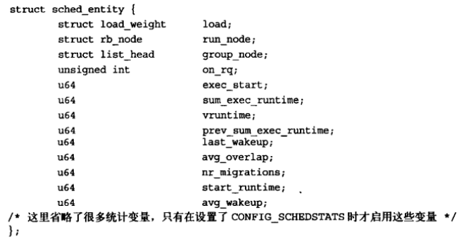
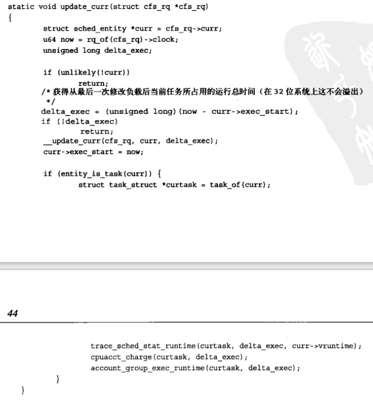
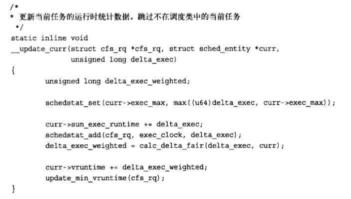
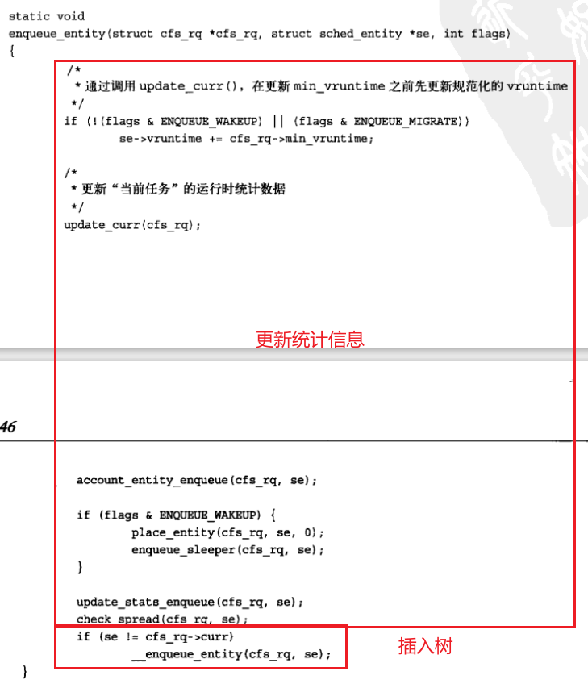
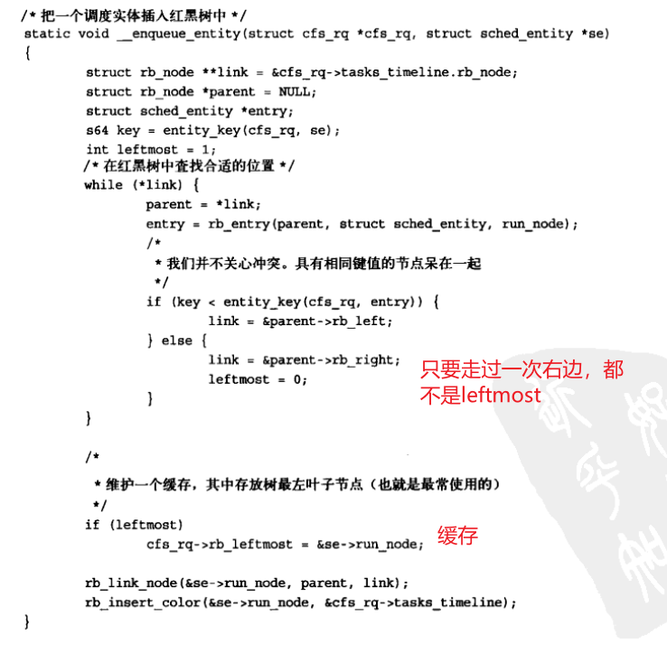
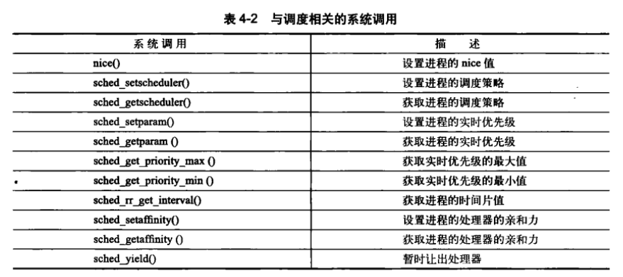

# 进程调度

进程调度程序可看作在可运行态进程之间分配优先的处理器时间资源的内核子系统。

## 多任务

多任务系统可分为两类：非抢占式多任务、抢占式多任务。
1. Linux是抢占式多任务模式，由调度程序决定什么时候停止一个进程的运行。进程在被抢占之前能够运行的时间是预先设置好的，叫进程的时间片。有效管理时间片能使调度程序从系统全局的角度做出调度决定，避免个别进程独占系统资源。
2. 在非抢占式多任务模式下，除非进程主动停止运行，否则会一直执行。进程主动挂起自己的操作称为让步。这种机制有很多缺点：调度程序无法对每个进程该执行多长时间做出统一规定，进程独占时间可能超过预料，一个不做出让步的悬挂进程能使系统崩溃。

## Linux的进程调度

1. Linux 1.0~2.4内核系列，调度程序很简陋。
2. Linux 2.5开始采用叫O(1)调度程序的新调度程序——因其算法的行为而得名。关键是：静态时间片算法、针对每一处理器的运行队列。但是该算法对调度那些响应时间敏感的程序（交互进程，如很多交互进程的桌面）先天不足。
3. Linux 2.6引入新进程调度算法“反转楼梯最后期限调度算法（Rotaing Staircase Deadline scheduler）”（RSDL），吸取队列理论，将公平调度的概念引入。最终在Linux 2.6.23内核版本中替代O(1)调度算法，被称为“完全公平调度算法”，简称CFS。

## 策略
### I/O消耗型和处理器消耗型的进程

进程可分为 I/O消耗型、处理器消耗型

1. I/O消耗型：大部分时间用于提交I/O请求或等待I/O请求。经常处于可运行状态，但通常运行短短的一会儿，因为等待I/O时总会阻塞。
2. 处理器消耗型：大部分时间用在执行代码上，除非被抢占，否则一直不停地运行，没有太多是I/O请求。但是因为不属于I/O驱动类型，从系统响应角度考虑，调度器不应该经常让它们运行。调度策略往往尽量降低它们的调度频率，而延长其运行时间。极端例子就是无限循环执行，更具代表性的例子是执行大量输血计算的程序。如sshkeygen或matlab

该划分方法并非绝对，
1. 进程可能同时展示两种行为，如：X Windows服务器既是I/O消耗型，又是处理器消耗型。
2. 也可能来回切换，典型例子是字处理器，通常等待键盘输入，但在任一时刻可能又粘住处理器疯狂地进行拼写检查或红运算。

调度策略通常要在两个矛盾目标中间寻找平衡：
1. 进程响应迅速（响应时间短）
2. 最大系统利用率（高吞吐量）

Linux更倾向于优先调度I/O消耗型进程。

### 进程优先级

Linux采用两种优先级范围：nice值、实时优先级
1. nice值的范围是-20 ~ +19，默认值为0；越大的nice值意味着更低的优先级。是所有Unix系统中标准化概念，但不同Unix系统调度算法不同，nice值的运用方式也不同。如Mac OS X，nice值代表分配给进程的时间片的绝对值；Linux系统中，nice值代表时间片比例。
2. 实施优先级的值是可配置的，范围在0 ~ 99，越高的实时优先级数值意味着进程优先级越高。任何实时进程的优先级都高于普通进程。实时优先级与nice优先级处于互不相交的范畴。

### 时间片

表明进程被抢占前能持续运行的时间，必须规定默认的时间片。时间片过长导致响应欠佳，过短会增大进程切换带来的处理器耗时。
很多系统重视交互响应时间，因此默认时间片很短，如10ms。但Linux的CFS调度器没有直接分配时间片到进程，它是将处理器使用比划分给进程，进程获得的处理器时间和系统负载密切相关。
1. Linux系统是抢占式，当进程进入可运行态，就被准许投入运行。CFS调度器，其抢占实际取决于新的可运行程序消耗多少处理器使用比，如果消耗使用比比当前进程小，则新进程立即投入运行，抢占进程，否则推迟运行。
2. 多数操作系统，是否要将一个进程投入运行完全由进程优先级和是否有时间片决定。

## Linux调度算法
### 调度器类

Linux调度器是以模块方式提供的，这样做的目的是允许不同类型的进程可以有针对性地选择调度算法。

`为什么进程可以选择调度算法？？？不应该是先选择调度器，再调度进程吗？？？从这句话理解的是先调度进程，再根据进程选择调度器？？？？`

这种模块化结构被称为调度器类，允许多种不同的可动态添加的调度算法并存，调度属于自己范畴的进程。每个调度器有一个优先级，会按照优先级顺序遍历调度类，拥有一个**可执行进程**的**最高优先级**的调度器胜出，去选择下面要执行的程序。

CFS是一个针对普通进程的调度类，在Linux中称为SCHED_NORMAL。

### Unix系统中的进程调度

传统Unix中优先级以nice值形式输出，会导致一些反常问题。

1. 问题一：要将nice值映射到时间片，必然需要将nice单位值对应到处理器时间，但这样做将导致进程切换无法最优化进行。
2. 问题二：相对nice值。假设第一个nice值是0，第二个是1，分别映射到时间片100ms和95ms，时间片几乎一样。但如果分别赋予18和19的nice值，分别映射为10ms和5ms，前者能获得两倍的处理器时间。不过nice通常使用相对值，把nice值减1带来的效果极大取决于初始值。

`这里是什么意思，以及映射的方法是什么？？？`

3. 问题三：执行nice值到绝对时间片的映射，这个绝对时间片必须能在内核的测试范围内，意味着时间片必须是定时器节拍的整数倍。但这么做会引发几个问题：
   1. 首先，最小时间片必然是节拍器的整数倍，也就是10ms和1ms的倍数。
   2. 其次，系统定时器限制了两个时间片的差异：连续的nice值映射到时间片，其差别范围至少10ms或少则1ms。
   3. 最后，时间片会随定时器节拍改变。
4. 问题四：基于优先级的调度器为优化交互任务，对新要唤醒的进程提高优先级，即使时间片用尽。但给某些特殊的睡眠/唤醒用力一个玩弄调度器的后门，打破公平原则，损害其他进程利益。

以上问题可以通过改造解决。

1. nice值呈几何增加而非算数增加解决问题二
2. 采用新度量机制将从nice值到时间片的映射与定时器节拍分离开，解决第三个问题。

但是以上解决方法都回避了实质问题——分配绝对时间片引发的固定的切换频率，给公平性造成了很大变数。

CFS对时间片分配方法进行根本性的重新设计：**完全摒弃时间片**而是**分配处理器使用比重**。确保进程调度中能有恒定的稳定性。

### 公平调度

CFS出发点基于一个简单理念：进程调度的效果应如同系统具备一个理想中的完美任务处理器。在这个系统中，每个进程将能获得1/n的处理器时间。同时可以调度给它们无限小的时间周期，在任何可测量周期内，给予n个进程中每个进程相同的运行时间。

但是抢占会带来代价，CFS考虑这部分额外消耗，实现中保证系统性能不受损失，做法是允许每个进程运行一段时间、循环轮转、选择运行最少的进程作为下一个运行进程，在所有可运行进程总数基础上计算出一个进程要运行多久，而不是时间片。

每个进程按照其权重在全部可运行进程中所占比例的“时间片”运行。CFS为完美多任务中无限小周期近似值设立一个目标，这个目标称作“目标延迟”，越小周期越好交互，但切换代价更高且系统总吞吐能力更差。假设目标延迟值为20ms，两个相同优先级的可运行任务，每个任务在被其他任务抢占前运行10ms，如果有4个任务，每个运行5ms，如果有20个，每个运行1ms。

当任务数量趋于无穷时，可获得处理器使用比和时间片都将趋于0，这样无疑造成了不可接受的切换消耗。CFS为此引入每个进程获得的时间片底线，称为**最小粒度**，默认为1ms。

例如一个nice值为0，一个nice值为5，后者权重默认将是前者的1/3（？？？），如果目标延迟是20ms，分别获得15ms和5ms的运行时间。如果nice值分别是10和15，分配的运行时间片还是15ms和5ms。

## Linux调度的实现

CFS代码位于文件kernel/sched_fair.c中，关注四个组成部分：

- 时间记账
- 进程选择
- 调度器入口
- 睡眠和唤醒

### 时间记账

#### 1.调度器实体结构

CFS需要确保进程只在公平分配给它的处理器时间内运行，使用调度器实体结构（struct sched_entity）来追踪记账。

作为名为se的成员变量嵌入到task_struct中。

#### 2.虚拟实时

vruntime变量存放虚拟运行时间，该运行时间是经过所有可运行进程总数的标准化（被加权的），以ns为单位，所以不再与定时器节拍相关。

update_curr()函数实现该记账功能：

update_curr计算当前进程执行时间，存到delta_exec，然后传递给__update_curr，由后者**根据进程总数进行加权计算**，再与当前运行进程的vruntime相加。update_curr()是由系统定时器周期性调用，无论进程处于可运行态还是不可运行态，vruntime可以准确测量出给定进程的运行时间，知道谁是下一个被运行的进程。

### 进程选择

CFS选择会挑选具有最小vruntime的进程作为下一个运行进程。CFS利用红黑树组织可运行进程队列，利用其迅速找到最新奥vruntime的进程。在Linux中，红黑树被称为rbtree，是一个自平衡的二叉搜索树。

#### 1.挑选下一个任务

CFS会运行rbtree树中最左边叶子节点所代表的进程。使用__pick_next_entity()函数，本身不是遍历树寻找最左叶子节点，因为该值已经缓存在rb_leftmost字段中。如果返回NULL，表示没有最左叶子节点，也就是说树中没有任何节点，CFS调度器会选择idle任务运行。

#### 2.向树中加入进程

在进程变为可运行状态（被唤醒）或是通过fork()调用第一次创建进程时，CFS将进程加入rbtree以及缓存最左叶子节点。使用enqueue_entity()函数实现这一目的：

然后调用__enqueue_entity()进行繁重的插入操作：

rb_link_node()是将进程插入称为其子节点，然后调用rb_insert_color维护自平衡。

#### 3.从树中删除进程

删除动作发生在进程阻塞或终止时，dequeue_entity()->__dequeue_entity()，tbtree实现了rb_erase()函数。该函数删除后会更新rb_leftmost缓存。

### 睡眠与唤醒

1. 内核把自己标记成休眠状态，从可执行红黑树中移出，放入等待队列，然后调用schedule()选择和执行一个其他进程。
2. 唤醒刚好相反，进程被置为可执行状态，然后再从等待队列中移到可执行红黑树中。

#### 1.等待队列

等待队列是由等待某些时间发生的进程组成的简单链表。内核用wake_queue_head_t来代表等待队列。等待队列可以通过DECLARE_WAITQUEUE()静态创建，也可以由init_waitqueue_head()动态创建。

进程通过执行几个步骤将自己加入到等待队列中

1. 调用DEFINE_WAIT()宏创建等待队列项
2. 调用add_wait_queue()把自己加入到队列中
3. 调用prepare_to_wait()将状态变更为TASK_INTERRUPTTIBLE或TASK_UNINTERRUPTIBLE
4. 如果状态是TASK_INTERRUPTIBLE，则信号唤醒进程。
5. 当被唤醒时，再次检查条件是否为真，若是退出循环，否则再次调用schedule()
6. 当条件满足时，将自己设置为TASK_RUNNING并调用finish_wait()移出等待队列。

#### 2.唤醒

通过wake_up()->try_to_wake_up()，该函数负责将进程设置为TASK_RUNNING，调用enqueue_task()将进程放入rbtree。如果优先级比正在执行的优先级高的话，会设置need_resched标志。

## 抢占和上下文切换

由kernel/sched.c中的context_switch()函数负责，每当新进程被选出来准备投入运行时，schedule()就会调用这个函数，它完成两项基本工作：

1. 调用switch_mm()，把虚拟内存切换到新进程。
2. switch_to()，切换处理器状态，包括保存、回复栈信息和寄存器信息，以及其他任何和体系结构相关的状态信息，都必须以每个进程为对象进行管理和保存。

内核提供**need_resched标志**表明是否需要重新执行一次调度。

1. 当某个进程应该被抢占时，scheduler_tick()会设置这个标志
2. 优先级高的进程执行可执行状态时，try_to_wake_up()也会设置该标志，内核检查该标志，确认其被设置，调用schedule()切换到新进程。
3. 返回用户空间以及中断返回时，内核也会检查need_resched标志，若被设置，内核会 在继续执行之前 调用 调度程序。

### 用户抢占

内核即将返回用户空间的时候，如果need_resched标志被设置，会导致schedule()被调用，此时会发生用户抢占。简而言之，用户抢占在以下情况下发生：

1. 从系统调用返回用户空间时
2. 从中断处理程序返回用户空间时

### 内核抢占

与其他大部分Unix变体和其他大部分操作系统不同，Linux完整地支持内核抢占。在不支持内核抢占的内核中，调度程序没有办法在一个内核级任务正在执行的时候重新调度。

只要没有持有锁，内核就可以进行抢占。锁是非抢占区域的标志。为支持内核抢占，为每个进程的thread_info引入preempt_count计数器。该计数器初始值为0，每当使用锁的时候数值加1，释放锁的时候减1。当数值为0时可以抢占。

内核抢占发生在：

1. 中断处理程序正在执行，且返回内核空间之前。
2. 内核代码再一次具有可抢占的时候。
3. 内核中的任务显示调用schedule()，此时认为该任务清楚自己是可以安全地被抢占的。
4. 内核中的任务阻塞（这同样也会导致调用schedule()）

## 实时调度策略

Linux提供了两种实时调度策略：SCHED_FIFO、SCHED_RR。而普通的调度策略是SCHED_NORMAL。借助调度类框架，实时策略并不被CFS调度器管理，而是一个特殊的实时调度器管理。具体定义在kernel/sched_rt.c中。

1. SCHED_FIFO：实现一种简单的、先入先出的调度算法：不使用时间片。处于可运行状态的SCHED_FIFO级进程会比normal进程先得到调度。一旦进入可执行状态，就会一直执行，知道受阻或显式释放。它不基于时间片，因此可一直执行下去。只有更高级别的SCHED_FIFO、SCHED_RR才能抢占。同级别的会轮流执行。

2. SCHED_RR：与SCHED_FIFO大体相同。只是SCHED_RR级进程在耗尽事先分配给它的时间片后就不再执行，是带有时间片的SCHED_FIFO。当SCHED_RR任务耗尽时间片，同级别其他实时进程被轮流调度。时间片只用来调度同一优先级进程。高优先级总数立即抢占低优先级。

这两种实时算法是静态优先级，不为进程计算动态优先级，能保证高优先级总能抢占低优先级的进程。

实时优先级范围从0到MAX_RT_PRIO减1，默认情况下MAX_RT_PRIO为100。SCHED_NORMAL级进程的nice值共享这个取值空间，从MAX_RT_PRIO到MAX_RT_PRIO+40，默认情况下nice的值从-20~+19对应实时优先级100~139。

## 与调度相关的系统调用

Linux提供一个系统调用族，用于管理与调度程序相关参数。可以用来操作和处理进程优先级、调度策略及处理器绑定，还提供了显式地将处理器交给其他进程的机制。

### 与调度策略和优先级相关的系统调用

1. sched_setschduler()和sched_getschrduler()的实现有许多参数检查、初始化、清理组成，最终要的工作在于读取和改写进程task_struct的policy和rt_priority的值
2. sched_setparam()和sched_getparam()这两个系统调用获取封装在sched_param特殊结构体rt_priority中。
3. sched_get_priority_max()和sched_get_priority_min()分别获取给定调度策略的最大和最小优先级，分别是MAX_USER_RT_PRIO减1和1。
4. 对于普通进程，nice()函数可以给静态优先级一个给定的量，只有超级用户才能设置负值以提高优先级。它会调用内核的set_user_nice()函数，设置进程task_struct的static_prio和prio值。

### 与处理器绑定相关的系统给调度。

Linux调度程序提供强制的处理器绑定（processor affinity）机制。试图使进程在同一个处理器上运行，也允许用户强制指定”必须在这些处理器上运行“。这种强制亲和性保存至task_struct的cpus_allowed这个位掩码标志中。该掩码标志每一位对应一个系统可用的处理器，默认情况下都被设置。用户可通过sched_setaffinity()设置，调用sched_getaffinity()返回cpus_allowed位掩码。

强制处理器绑定方法很简单。

1. 当处理第一次创建时，继承父进程的相关掩码。
2. 当处理器绑定关系发生改变时，内核会采用”移植线程“把任务推到合法的处理器上
3. 加载平衡器只把任务拉到允许的处理器上。

### 放弃处理器时间

Linux通过sched_yield()系统调用，提供让进程显示地将处理器时间让给其他等待执行进程的机制。它通过将进程从活动队列一道过期队列中实现的。不仅抢占了该进程并将其放在优先级队列最后，还放入国企队列中，确保一段时间内不会被执行。由于实时进程不会过期，它们只被移动到其优先级队列最后面。应用程序甚至内核代码在调用sched_yield()之前，应仔细考虑是否真的希望放弃处理器时间。

1. 内核代码为了方便，可直接调用yield()：先要确定给定进程是否确实处于可执行状态，然后在调用sched_yield()。
2. 用户应用程序直接使用sched_yield()系统调用就可以了。
